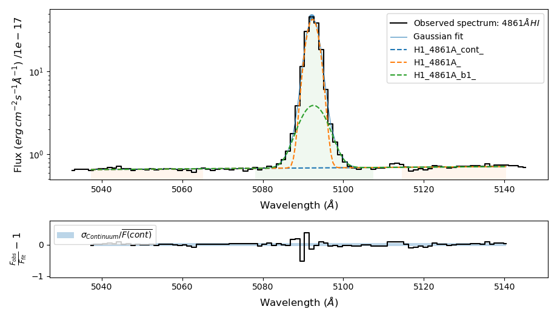
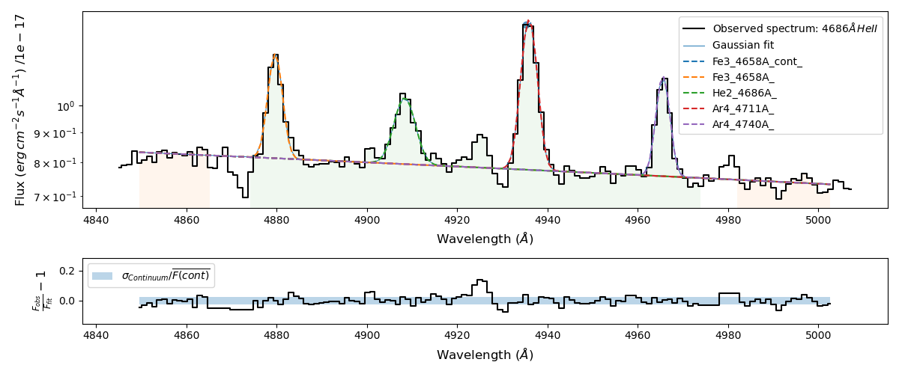
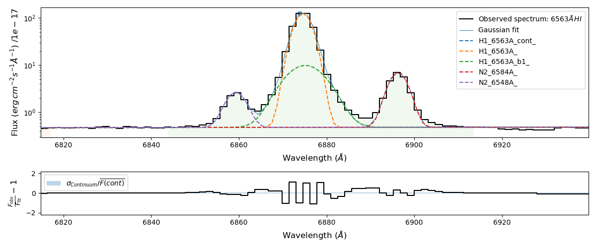

.. _inputs:

======
Inputs
======

In this chapter, we describe the inputs for :math:`\textsc{LiMe}` measurements: The line name, line mask
and fitting configuration. The first two are compulsory while the third is optional:

.. _lineLabel:

Line label
++++++++++

The line name provides :math:`\textsc{LiMe}` a label for the measurement as well as the transition wavelength and ion.
The label must have the following format based on the `pyneb notation <http://research.iac.es/proyecto/PyNeb//>`_:

  .. image:: ../_static/line_notation.png
    :scale: 40%
    :align: center

* **Single lines** are those generated by a single atomic transition with one kinematic component (default).

* **Blended lines** are those generated by more than one transition and/or kinematic components. :math:`\textsc{LiMe}`
  will try to fit multiple Gaussian profiles in the analysis of these lines.

* **Merged lines** are generated by more than one transition and/or kinematic component. However, :math:`\textsc{LiMe}`
  will only fit a single Gaussian profile. This category is useful for observations without the resolution to isolate
  individual components but we still need to keep of multiple components.

  .. note::
     Even with the blended **'_b'** and merged **'_m'** suffixes, the user still needs to include the line components in
     the fitting function. Otherwise, the lines will be treated as having a single component.

.. _lineMask:

Line mask
+++++++++

A line mask is a six-value vector with the line location and adjacent continua. In your scripts, this array must
be sorted in increasing order as in the image below:

  .. image:: ../_static/mask_selection.jpg
    :align: center

The first two values in the array ``(w1, w2)`` provide the limits of the left continuum band. The ``(w3, w4)`` wavelengths
are the line region limits. Finally, ``(w5, w6)`` are the limits of the right continuum band.

.. note::
    The wavelengths in the line mask array must be in the rest frame. The redshift you provide in the object
    ``lime.Spectrum`` definition will be used to set the line mask in the observed frame.

Profile configuration
+++++++++++++++++++++

By default :math:`\textsc{LiMe}` assumes that every line consists in a single Gaussian profile. Consequently, anything
more complex needs to be specified by the user. The multi-Gaussian profile is parametrised by the formula:

  .. math::

        F_{\lambda}=\sum_{i}A_{i}e^{-\left(\frac{\lambda-\mu_{i}}{2\sigma_{i}}\right)^{2}} + c_{\lambda}

On the left-hand side, :math:`F_{\lambda}` is the total flux per unit wavelength. On the right-hand side, we have two
components: The first one is the Gaussian profile flux, where :math:`A_{i}` is the height of a Gaussian profile above
the continuum level, :math:`\mu_{i}` is the center of the of Gaussian profile and :math:`\sigma_{i}` is the
standard deviation of the profile. The second component is the continuum level of the line :math:`c_{\lambda}`.
:math:`\textsc{LiMe}` assumes that this continuum is linear and computes an initial guess using the adjacent spectral
bands input mask.

:math:`\textsc{LiMe}` solves the mathematical system above thanks to `LmFit <https://lmfit.github.io/lmfit-py/>`_.
For each line, we define 5 `parameters <https://lmfit.github.io/lmfit-py/parameters.html>`_ per component in the equation
above. These are labeled using the line name and the following suffixes:

.. _fitTerms:

* **_amp**: the height of the Gaussian from the continuum in the spectrum flux (normalised) units.
* **_center**: the wavelength of the Gaussian peak in the spectrum wavelength units.
* **_sigma**: the width of the Gaussian curve in the spectrum wavelength units.
* **_cont_slope**: the local continuum gradient. In blended lines, there is only one continuum labeled after the first
  component.
* **_cont_intercept**: the linear flux at zero wavelength for the local continuum. In blended lines there is still only
  one continuum intercept labeled after the first component.

.. note::
   It should be explained that we are not using the default `Gaussian model in LmFit <https://lmfit.github.io/lmfit-py/builtin_models.html#lmfit.models.GaussianModel>`_:
   The built-in model defines the amplitude :math:`(A_{i})` as the area under the Gaussian profile. While this notation
   provides a cleaner mathematical description, in the fitting of astronomical spectra it is seldom easy to constrain
   the flux in advance. Instead, it is easier to impose limits on the line height, which is our definition.

For example, in the case of ``H1_6563A_b=H1_6563A-N2_6584A-N2_6548A`` blended group, the ``H1_6563A`` parameters would
be: ``H1_6563A_amp``, ``H1_6563A_center``, ``H1_6563A_sigma``, ``H1_6563A_cont_slope`` and ``H1_6563A_cont_intercept``.

Each of these `parameters <https://lmfit.github.io/lmfit-py/parameters.html>`_  can be adjusted individually before the
fitting with the following attributes.

* ``value``: Initial value for the parameter. :math:`\textsc{LiMe}` provides an initial guess for the parameters from
  the :ref:`integrated parameters <intgreatedProperties>`.
* ``vary``: Whether the parameter is free during the fitting (default is True). If set to *False* the initial ``value`` will
  remain unchanged.
* ``min``: Lower bound for the parameter value. The default is value is -numpy.inf (no lower bound).
* ``max``: Upper bound for the parameter value. The default is value is numpy.inf (no upper bound).
* ``expr``: Mathematical expression to constrain the value during the fit. The default value is None.

.. warning::
   These ``Parameter`` values should respect the spectrum units. Moreover, they should also include the ``lime.Spectrum``
   input normalization. Finally, in the case of the ``_center`` parameter, :math:`\textsc{LiMe}` assumes the ``value``,
   ``min`` and ``max`` values are in the rest frame and it will convert them into the observed frame (this may change in the
   future).

.. _profileFitting:

===============
Profile fitting
===============

:math:`\textsc{LiMe}` recommends defining the fitting configuration in an external file and importing it via the
``lime.load_cfg`` function. This guarantees that it has the format expected by the `LmFit parameters <https://lmfit.github.io/lmfit-py/parameters.html>`_.
You can learn more about the :math:`\textsc{LiMe}` workflow, using real astronomical data, from the tutorials.

:math:`\textsc{LiMe}` configuration files follow the `standard ini format <https://en.wikipedia.org/wiki/INI_file>`_. **The
sections with the profile configuration must have the ``_line_fitting`` suffix.** For example, this is the fitting
configuration from the :ref:`6th tutorial <example6>`:

.. code-block::

    [SHOC579_region0_line_fitting]
    O2_3726A_b = O2_3726A-O2_3729A-H1_3721A-H1_3734A
    H1_3889A_m = H1_3889A-He1_3889A
    Ar4_4711A_m = Ar4_4711A-He1_4713A
    H1_4861A_b = H1_4861A-H1_4861A_b1
    O3_4959A_b = O3_4959A-O3_4959A_b1
    O3_5007A_b = O3_5007A-O3_5007A_b1-He1_5016A
    H1_6563A_b = H1_6563A-H1_6563A_b1-N2_6584A-N2_6548A
    O2_7319A_b = O2_7319A-O2_7330A
    S3_9531A_b = S3_9531A-H1_9548A

    O2_3726A_kinem = O2_3729A
    H1_3712A_kinem = H1_3734A
    O2_3726A_cont_slope = vary:False
    O2_3726A_cont_intercept = vary:False

    H1_4861A_b1_sigma = expr:>2.0*H1_4861A_sigma
    H1_4861A_b1_amp = expr:<10.0*H1_4861A_amp

    O3_4959A_b1_sigma = expr:>2.0*O3_4959A_sigma
    O3_4959A_b1_amp = expr:<10.0*O3_4959A_amp

    O3_5007A_b1_sigma = expr:>2.0*O3_5007A_sigma
    O3_5007A_b1_amp = expr:<10.0*O3_5007A_amp
    He1_5016A_center = min:5014,max:5018
    He1_5016A_sigma = min:1.0,max:2.0

    H1_6563A_b1_sigma = expr:>2.0*H1_6563A_sigma
    H1_6563A_b1_amp = expr:<10.0*H1_6563A_amp
    H1_6563A_cont_slope = vary:False
    H1_6563A_cont_intercept = vary:False
    N2_6548A_amp = expr:N2_6584A_amp/2.94
    N2_6548A_kinem = N2_6584A

    S3_9531A_cont_slope = vary:False
    S3_9531A_cont_intercept = vary:False
    H1_9548A_sigma = min:1.0,max:2.0

.. note::
   You can feed the complete fitting configuration to the :math:`\textsc{LiMe}` functions. The library will know which
   the library will know which one applies to the current measurement.

The following sections include a few examples on how to customize the fittings and improve the quality of the measurements.

Line components label
+++++++++++++++++++++

The profile components in blended and merged lines are specified by a string, where the components are separated by a
dash (-). Each component must follow the :ref:`LiMe notation style <lineLabel>`:

.. code-block::

    O2_3726A_b = O2_3726A-O2_3729A-H1_3721A-H1_3734A
    H1_3889A_m = H1_3889A-He1_3889A
    H1_4861A_b = H1_4861A-H1_4861A_b1
    O3_5007A_b = O3_5007A-O3_5007A_b1-He1_5016A
    H1_6563A_b = H1_6563A-H1_6563A_b1-N2_6584A-N2_6548A

In some cases, intense emission lines can display multiple components. This is because they ions producing them are
located at different regions with distinctive kinematic conditions. In this case, you should label these profiles with
the same transition but with an additional suffix. This suffix must be predated by an underscore (_). Below, we have an
example for the fitting of :math:`H\beta`:

.. code-block::

    H1_4861A_b = H1_4861A-H1_4861A_w1
    H1_4861A_w1_sigma = expr:>2.0*H1_4861A_sigma
    H1_4861A_w1_amp = expr:<10.0*H1_4861A_amp

In this case we have ``H1_4861A_w1``, the ``w1`` suffix corresponds to the first "wide" component. Nonetheless, you should
be able to use any suffix you want.

.. warning::

   The order of the components should not affect the result of the fitting. However, it is recommended to sort them from
   higher to lower intensity. For example, ``H1_4861A_b = H1_4861A-H1_4861A_W1`` as in the fitting above. This is useful
   in some plots as the profiles color is derived by this order. This way, it is easier that the most intense components
   have the same colors in the plots within the spectra sample.

Incidentally, the lines do not need to be blended or merged. Indeed, you could use this scheme to fit various individual
lines simultaneously. For example, if we introduce a very wide mask for the ``He2_4686A_b`` line we could have :

.. code-block::

    He2_4686A_b = Fe3_4658A-He2_4686A-Ar4_4711A-Ar4_4740A

In most cases, however, it is recommended to fit lines individually whenever possible.

Mathematical expressions as constrains
++++++++++++++++++++++++++++++++++++++

In the `LmFit Parameters <https://lmfit.github.io/lmfit-py/parameters.html>`_, it is possible to defined boundaries as
a function of other parameters. For example, in the fitting of the :math:`H\alpha` line, it is common to include the
:math:`[NII]6548,6584\AA`. These transitions originate from the same :math:`\left(^{1}D_{2}\right)` level. Therefore,
their photons ratio should be constant. Even though, in :math:`\textsc{LiMe}` Gaussian model we cannot impose constrains
on the Gaussian flux, we can use the lines amplitude as a proxy:

  .. math::

        \frac{F_{\left[NII\right]6584\text{Å}}}{F_{\left[NII\right]6548\text{Å}}}=\frac{\left(A\cdot2.5066\cdot\sigma\right)_{\left[NII\right]6584\text{Å}}}{\left(A\cdot2.5066\cdot\sigma\right)_{\left[NII\right]6548\text{Å}}}=\frac{A_{\left[NII\right]6584\text{Å}}}{A_{\left[NII\right]6548\text{Å}}}

where :math:`A` and :math:`\sigma` are the Gaussian profile amplitude and standard deviation. It is a fair assumption that
the gas velocity dispersion is the same for transitions originating from the same ion. Consequently, the :math:`\sigma`
terms cancel out.

In the configuration file, the parameter :ref:`attributes <fitTerms>` are comma (,) separated and the key-value entries
are separated by a colon (:). For example:

.. code-block::

    H1_6563A_b = H1_6563A-H1_6563A_w1-N2_6584A-N2_6548A
    N2_6548A_amp = expr:N2_6584A_amp/2.94
    H1_6563A_w1_sigma = expr:>2.0*H1_6563A_sigma
    H1_6563A_w1_amp = expr:<10.0*H1_6563A_amp,min:0

In the fitting above we have included three expression constrains. The first corresponds to the amplitude of ``N2_6548A``
as explained above. You may appreciate that these expression have the target line and gaussian parameter joined by an
underscore (_), hence ``N2_6548A_amp`` and ``N2_6584A_amp``.

Additionally, there are two constrains for the :math:`H\alpha` broad component (``H1_6563A_w1``). Both use the expression
attribute with the greater than (>) and less than (<) symbols along with a numerical value. In each parameter, these constrains
impose a softer boundary, where their value can be greater or smaller than another parameter. This constrain is
particularly useful while defining broad components in large data sets. This way, you can make sure that the broad
component always has the same label :math:`\sigma`.

.. warning::

   The inequality syntax is part of the :math:`\textsc{LiMe}` implementation of `LmFit <https://lmfit.github.io/lmfit-py/>`_.
   In the current beta release only multiplication can be used along the inequality term. Please contact the author if
   you have any issue/request with this functionality.

Importing line kinematics
+++++++++++++++++++++++++

While the amplitude of an emission profile is dominated by the emissivity of the corresponding transition and the gas
physical conditions; its width is mostly dependant on the gas kinematics. Moreover, discrepancies with the theoretical
wavelength are also due to the gas kinematics.

Consequently, in some cases it is useful to constrain the line velocity dispersion (:math:`\sigma`) and radial velocity in
the line of sight (:math:`v_{r}`) from the measurements of another line. For example:

  .. math::

    \sigma_{A} = \sigma_{B}\\
    v_{r,\,A} = v_{r,\,B}

where *A* and *B* are two line labels and both :math:`v_{r}` and :math:`\sigma` are in velocity units (for example km per second).

Converting the equations above to the spectrum wavelength units, we have:

  .. math::

    \sigma_{A} = \sigma_{B}\cdot\frac{\lambda_{A}}{\lambda_{B}}\left(\text{\AA}\right)\\
    \mu_{A} = \mu_{B}\cdot\frac{\lambda_{A}}{\lambda_{B}}\left(\text{Å}\right)

where :math:`\mu` and :math:`\lambda` are observed and theoretical transition wavelength respectively. The second term
takes into consideration the object redshift.

In the configuration file, these two constrains can be set simultaneously with the *_kinem* suffix on the line importing
the kinematics. For example:

.. code-block::

    [tests_line_fitting]
    O2_3726A_b = O2_3726A-O2_3729A-H1_3721A-H1_3734A
    O2_3726A_kinem = O2_3729A
    H1_3721A_kinem = H1_6563A
    H1_3734A_kinem = H1_6563A

    O2_3726A_cont_slope = vary:False
    O2_3726A_cont_intercept = vary:False

.. image:: ../_static/9_kinem_O2_Halpha.png
   :align: center

In this case you have two types of imports: In the first case, we are imposing the gas kinematics of the ``O2_3729A`` line
on to the ``O2_3726A`` line: The four parameters are tied together during the fitting. In contrast, in the case of
``H1_3721A`` and ``H1_3734A`` we are copying the gas kinematics from a previous measurement of the :math:`H\alpha` line.
In this case, the initial values for the Gaussian profile width and location are fixed prior to the fitting. Both
approaches are equally valid, however, **for the second case, the parent line** (:math:`H\alpha`) **must be measured prior to this fitting**.

.. warning::

   In the fitting above, you can see that the continuum parameters are fixed. This is usually a good practice in cases,
   where the continuum masks are small or there is a large broad component. Moreover, this also removes two dimensions
   from the fitting which should make easier the fitting of the Gaussian components.

