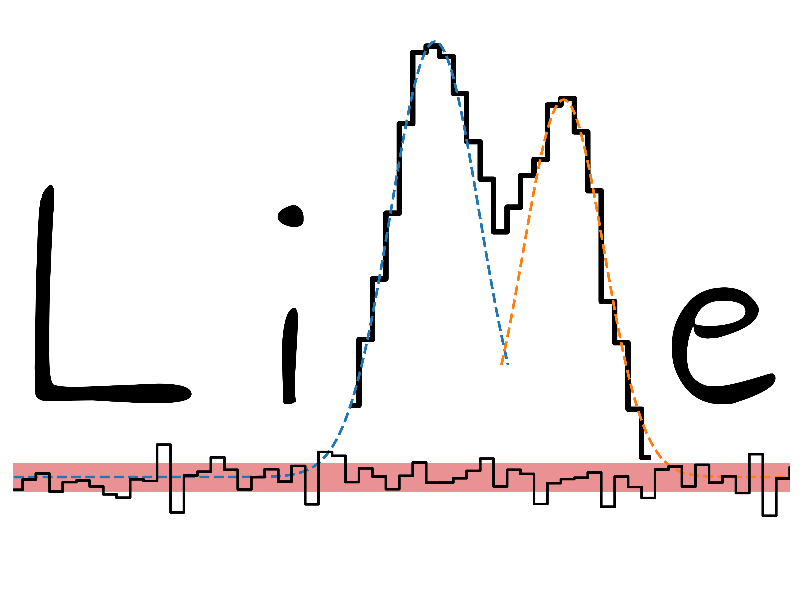

LiMe: A Line Measuring library
================================

This library provides a set of tools to fit emission lines from ionized spectra. Its design aims for a simple usage for
both single lines and Big Data observations. The emission labeling supports a multi-gaussian component fitting.
The measurements can be stored in several formats to facilitate the posterior analysis of the gas chemistry and kinematics.

These are some of the features currently available:

* Integrated and gaussian flux measurement of emission lines
* The user can include the pixel error in the calculation.
* Multi-Component gaussian fitting for emission lines with user defined boundaries for the Gaussian profile parameters and continuum.
* Algorithms are available to confirm the presence of emission lines queried by the user.
* Static and interactive plots for the visual appraisal of the inputs and outputs
* Emission line labels adhere to the `PyNeb <http://research.iac.es/proyecto/PyNeb/>`_ format.
* The >40 parameters lines log can be stored as a multipage *.fits* file for the batch treatment of large datasets.

.. admonition:: Where to find what you need
   :class: hint

   💻 To install or update the library go the `installation page <documentation/installation.html>`_. The source code is
   available in `github <https://github.com/Vital-Fernandez/lime>`_ for those who want to review/fork it.

   🚀 For a quick start go to the **Tutorials** section. These are organized by increasing complexity and they
   provide working knowledge of the algorithms mechanics.

   🌀 The tutorials are also available as python scripts in the LiMe `github examples folder <https://github.com/Vital-Fernandez/lime/tree/master/examples>`_.
   The examples data can also be found there.

   📈 For the physical summary of the library measurements, as well as the code technical description go to the
   **Documentation**  section.

.. :ref:`doc-tree`

.. toctree::
   :maxdepth: 1
   :caption: Documentation
   :name: doc-tree

   documentation/installation
   documentation/measurements
   documentation/api

.. toctree::
   :maxdepth: 1
   :caption: Tutorials
   :name: tutorial-tree

   tutorials/1_BasicFit
   tutorials/2_Synthetic
   tutorials/3_CompleteSpec
   tutorials/4_Mask_selection
   tutorials/5_IFU_masks

