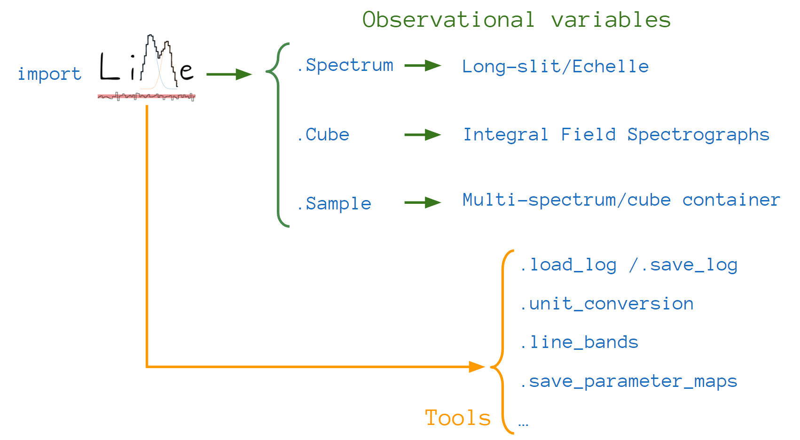
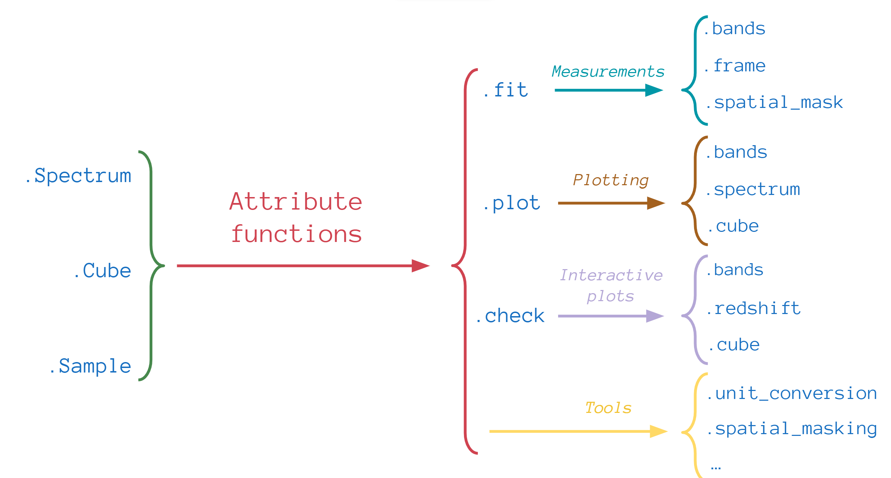

.. _api:

API
===

Most of :math:`\textsc{LiMe}` functions can be organized in two categories. In the first one we have the ``Spectrum``,
``Cube`` and ``Sample`` classes. These functions recreate astronomical observations:

The second set of functions belong to the astronomical objects mentioned above. For example, the ``.fit``, ``.plot`` or
``.check`` functions allow us to measure, plot and interact with the data:

Finally, there are additional utility functions. Some of these tools belong to the astronomical objects or they can be
imported directly from :math:`\textsc{LiMe}` or both (as in the case of ``.load_log``/``.save_log``)

In the following sections we describe these functions and their attributes.

Tools
-----

.. autofunction:: lime.load_cfg

    .. figure:: ../../../examples/images/conf_file_osiris.png
       :align: center

       Example of :math:`\textsc{LiMe}` configuration file

.. autofunction:: lime.load_log

.. autofunction:: lime.save_log

.. autofunction:: lime.line_bands

.. autofunction:: lime.label_decomposition

.. autofunction:: lime.Spectrum.line_detection

.. autofunction:: lime.tools.logs_into_fits

Astronomical objects
--------------------

.. autoclass:: lime.Spectrum

.. autoclass:: lime.Cube

Line fitting
------------

.. autofunction:: lime.workflow.SpecTreatment.bands

.. autofunction:: lime.workflow.SpecTreatment.frame

.. autofunction:: lime.workflow.CubeTreatment.spatial_mask

Plotting
--------

.. autofunction:: lime.plots.SpectrumFigures.spectrum

.. autofunction:: lime.plots.SpectrumFigures.bands

.. autofunction:: lime.plots.SpectrumFigures.grid

.. autofunction:: lime.plots.CubeFigures.cube

Interactive plotting
--------------------

.. autofunction:: lime.plots_interactive.BandsInspection.bands

.. autofunction:: lime.plots_interactive.CubeInspection.cube

