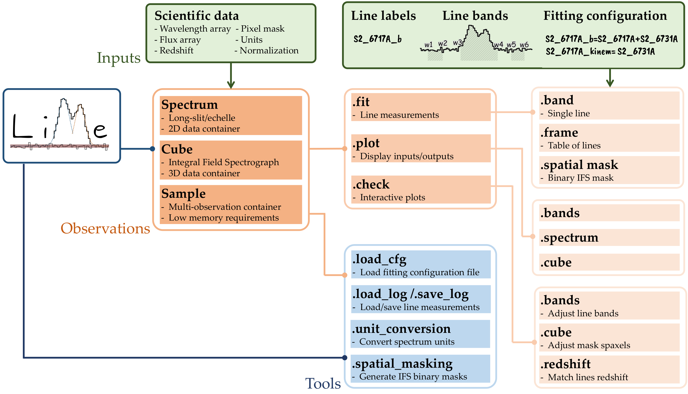

.. _api:

API
===

:math:`\mathrm{LiMe}` features a composite software design, utilizing instances of other classes to implement the target
functionality. This approach is akin to that of IRAF: Functions are organized into multi-level packages, which users
access to perform the corresponding task. The diagram below outlines this workflow:

At the highest level, :math:`\mathrm{LiMe}` provides of observational classes: spectrum, cube, and sample. The first two are essentially
2D and 3D data containers, respectively. The third class functions as a dictionary-like container for multiple spectrum
or cube objects. Moreover, as illustrated in the figure above, various tools can be invoked via the :math:`\mathrm{LiMe}`
import for tasks, such as loading and saving data. Many of these functions are also within the observations.

At an intermediate level, each observational class includes the *.fit*, *.plot*, and *.check* objects.
The first provides functions to launch the measurements from the observation data. The second organizes functions to plot
the observations and/or measurements, while the \emph{.check} object facilitates interactive plots, allowing users to
select or adjust data through mouse clicks or widgets. In these functions, users must specify an output file to store
these user inputs.

Finally, at the lowest level, we find the functions that execute the measurements or plots. Beyond the aforementioned
functionality, the main distinction between these commands lies in the extent of the data they handle. For instance,
the `Spectrum.fit.bands <https://lime-stable.readthedocs.io/en/latest/introduction/api.html#lime.workflow.SpecTreatment.bands>`_
and `Spectrum.fit.frame <https://lime-stable.readthedocs.io/en/latest/introduction/api.html#lime.workflow.SpecTreatment.frame>`_
commands fit a single line and a list of lines in a spectrum, respectively. Conversely, the
`Cube.fit.spatial_mask <https://lime-stable.readthedocs.io/en/latest/introduction/api.html#lime.workflow.CubeTreatment.spatial_mask>`_
command fits a list of lines within a spatial region of an IFS cube.

The next sections detail the functions attributes and their outputs:

Inputs/outputs
--------------

.. autofunction:: lime.load_cfg

    .. figure:: ../../../examples/images/conf_file_osiris.png
       :align: center

       Example of :math:`\mathrm{LiMe}` configuration file

.. autofunction:: lime.load_frame

.. autofunction:: lime.save_frame

.. autofunction:: lime.OpenFits.sdss

Tools
-----

.. autofunction:: lime.line_bands

.. autofunction:: lime.label_decomposition

.. autofunction:: lime.Spectrum.line_detection

.. autofunction:: lime.tools.join_fits_files

.. autofunction:: lime.unit_conversion

Astronomical objects
--------------------

.. autoclass:: lime.Spectrum

.. autofunction:: lime.Spectrum.from_file

.. autofunction:: lime.Spectrum.unit_conversion

.. autoclass:: lime.Cube

.. autofunction:: lime.Cube.from_file

.. autofunction:: lime.Cube.unit_conversion

.. autoclass:: lime.Sample

.. autofunction:: lime.Sample.from_file

Fitting
-------

.. autofunction:: lime.workflow.SpecTreatment.bands

.. autofunction:: lime.workflow.SpecTreatment.frame

.. autofunction:: lime.workflow.SpecTreatment.continuum

.. autofunction:: lime.workflow.CubeTreatment.spatial_mask

Plotting
--------

.. autofunction:: lime.plotting.plots.SpectrumFigures.spectrum

.. autofunction:: lime.plotting.plots.SpectrumFigures.bands

.. autofunction:: lime.plotting.plots.SpectrumFigures.grid

.. autofunction:: lime.plotting.plots.CubeFigures.cube

Interactive plotting
--------------------

.. autofunction:: lime.plotting.plots_interactive.BandsInspection.bands

.. autofunction:: lime.plotting.plots_interactive.CubeInspection.cube

