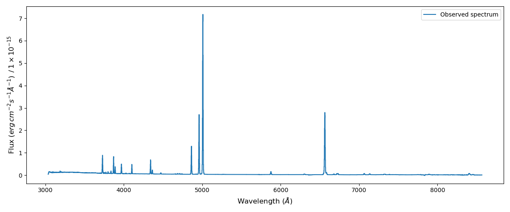
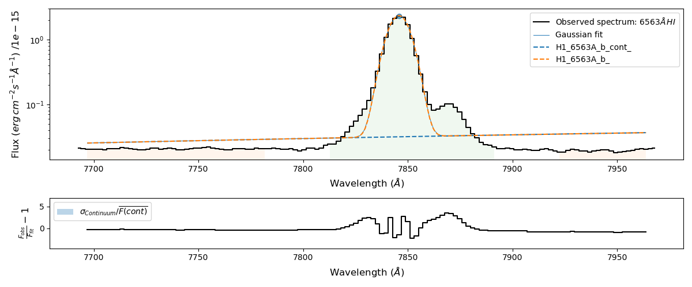
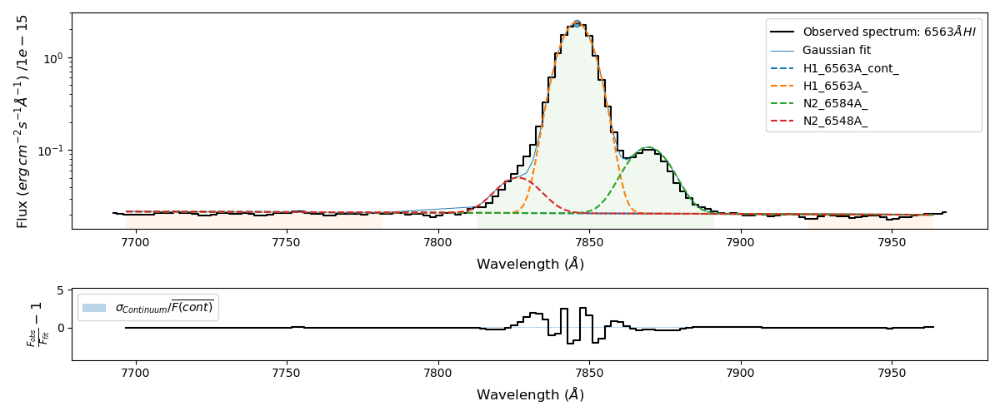

1) Simple line fitting
======================

In this example we perform single line fits on the emission spectrum of the Green Pea galaxy GP121903 which was observed
with the GTC (Gran Telescopio de Canarias). You can download this spectrum from the `github examples folder <https://github.com/Vital-Fernandez/lime/tree/master/examples>`_.
You can read more about this data set in `Fernandez et al (2021) <https://arxiv.org/abs/2110.07741>`_.

This tutorial can also be found as a python script in the `github 1st example <https://github.com/Vital-Fernandez/lime/blob/master/examples/example1_single_line_fit.py>`_.

Loading the spectrum
------------------------

Once you have installed the library, you may import it into your scripts

.. code-block:: python

    import numpy as np
    from astropy.io import fits
    import lime

Please check the version you are version you are using, whenever you have a question/issue/comment you want to share at
github.

.. code-block:: python

    print(lime.__version__)

We can start by opening the .fits file. We can use `Astropy fits module <https://docs.astropy.org/en/stable/io/fits/index.html>`_ to
reconstruct the spectrum:

.. code-block:: python

    def import_osiris_fits(file_address, ext=0):

        # Open the fits file
        with fits.open(file_address) as hdul:
            data, header = hdul[ext].data, hdul[ext].header

        # Reconstruct the wavelength array from the header data
        w_min, dw, n_pix = header['CRVAL1'],  header['CD1_1'], header['NAXIS1']
        w_max = w_min + dw * n_pix
        wavelength = np.linspace(w_min, w_max, n_pix, endpoint=False)

        return wavelength, data, header

    # Address of the Green Pea galaxy spectrum
    gp_fits = './sample_data/gp121903_BR.fits'

    # Load the spectrum
    wave, flux, hdr = import_osiris_fits(gp_fits)

Most of :math:`\textsc{LiMe}` functions are performed by the Spectrum class: This object stores your spectrum and performs the line
fitting functions. Its obligatory inputs are the spectrum wavelength and flux. However, in order to identify and
labeling the lines a redshift input is likely necessary (unless z = 0). Finally, many line fitting functions will fail
in the non-normalized CGS units commonly used in spectra. Consequently, it is recommended to introduce a normalization
value. In the case of GP121903:

.. code-block:: python

    # Galaxy redshift and the flux normalization
    z_gp = 0.19531
    normFlux_gp = 1e-18

.. note::

    Despite these inputs the measurement will be performed in the observed framed. Moreover, they are stored
    in the input flux units without the normalization.

Using this information, the Spectrum object is defined as:

.. code-block:: python

    gp_spec = lime.Spectrum(wave, flux, redshift=z_gp, norm_flux=normFlux_gp)

As additional inputs, you may provide the sigma (uncertainty) spectrum and a two value array to crop the spectrum
wavelength range (in the same frame as the input wavelength).

To display the input spectrum you can use the function:

.. code-block:: python

    gp_spec.plot_spectrum(spec_label='GP121903')

To fit a line we need to provide its location: Two wavelengths marking the spectrum region where the line is located.
Additionally, you need to define two continuum regions on the left and right hand side of the line. Therefore, you need
to provide a six value array ordered from lower to higher wavelengths:

.. image:: ../_static/mask_selection.jpg

For this Green Pea spectrum the Hα mask is:

.. code-block:: python

   line = 'H1_6563A'
   lineWaves = np.array([6438.03, 6508.66, 6535.10, 6600.95, 6627.70, 6661.82])

In this array the first two values correspond to the left continuum, the third and fourth values correspond to the line
region and the the final two values correspond to the right hand side continuum. These values must be in the rest frame.

Let's fit the Hα line using the function fit_from_wavelengths

.. code-block:: python

    gp_spec.fit_from_wavelengths(line, lineWaves)

You can plot the fit using:

.. code-block:: python

    gp_spec.display_results()

You can see that the fitting is not very good. Let's increase the complexity by including the [NII] lines:

.. code-block:: python

    line = 'H1_6563A_b'
    Halpha_conf = {'H1_6563A_b':     'H1_6563A-N2_6584A-N2_6548A',
                   'N2_6548A_amp':   {'expr': 'N2_6584A_amp/2.94'},
                   'N2_6548A_kinem': 'N2_6584A'}

The dictionary above has three elements:

* First: The line labelled as 'H1_6563A_b' consists in three components: H1_6563A, N2_6584A and N2_6548A
* Second: The line labelled as 'N2_6548A' has an amplitude value fixed by the amplitude fitted in the line "N2_6584A"
* Three: The line labelled as 'N2_6548A' has its kinematics (both radial and dispersion velocity) imported from those fit in the line N2_6548A.

Now we include this information in the fitting:

.. code-block:: python

    gp_spec.fit_from_wavelengths(line, lineWaves, fit_conf)
    gp_spec.display_results()

This time the fitted profile better represents the observation.

Finally, the results can be saved as a table using the ``lime.save_line_log`` function. The log output format is
determined from the user address extension. Moreover, the user can also provide a page name for multi-page files (excel, fits
and asdf). This way the each new log will append a page to the output file or update the one already there. Finally, the
user can provide a list of parameter to limit the measurements columns in the output file. You can find the parameters
parameters keywords in the :ref:`measurements documentation <measurements_page>`.

.. code-block:: python

    lime.save_line_log(gp_spec.log, './sample_data/example1_linelog.txt')
    lime.save_line_log(gp_spec.log, './sample_data/example1_linelog.fits', ext='GP121903')
    lime.save_line_log(gp_spec.log, './sample_data/example1_linelog.pdf', parameters=['eqw', 'gauss_flux', 'gauss_err'])
    lime.save_line_log(gp_spec.log, './sample_data/example1_linelog.xlsx', ext='GP121903')
    lime.save_line_log(gp_spec.log, './sample_data/example1_linelog.asdf', ext='GP121903')
