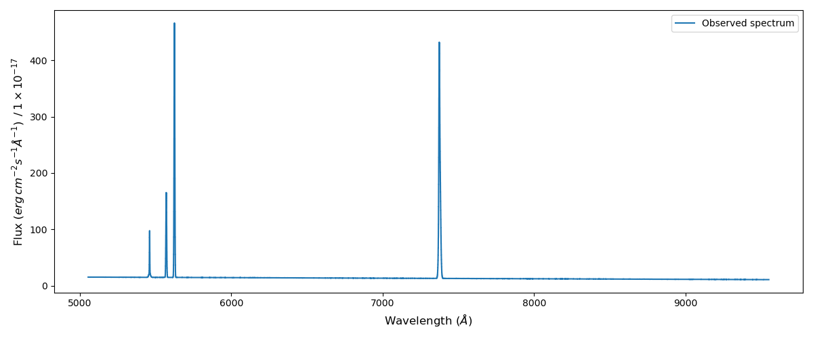
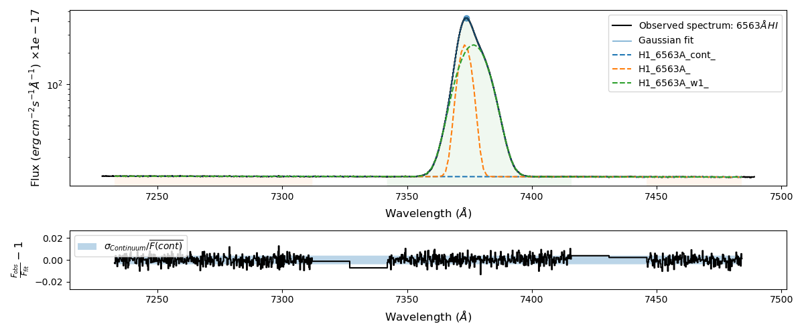
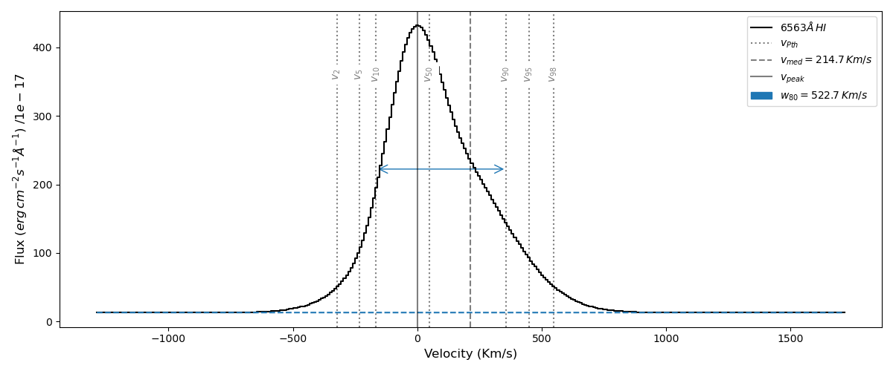

2) Fitting a synthetic spectrum
===============================

In this tutorial we perform some fits on a synthetic spectrum. This is a good exercise to test the accuracy and precision
of LiMe.

Let's start by defining the units, wavelength range and some lines for the synthetic spectrum:

.. code-block:: python

    import numpy as np
    import lime

    # The object spectrum and flux normalization
    z_gp = 0.19531
    normFlux_gp = 1e-14

    # Wavelength range definition
    hdr_dict = {'CRVAL1': 4500.0,
               'CD1_1': 0.2,
               'NAXIS1': 20000}

    w_min = hdr_dict['CRVAL1']
    dw = hdr_dict['CD1_1']
    nPixels = hdr_dict['NAXIS1']
    w_max = w_min + dw * nPixels

    wave_rest = np.linspace(w_min, w_max, nPixels, endpoint=False)
    wave_obs = (1 + z_true) * wave_rest

    # Linear continuum : slope and interception
    cont_coeffs = np.array([-0.001, 20.345])

    # Gaussian emission lines:
    # [Amplitude (height (normalized flux)), center (angstroms) and sigma (angstroms)]
    emission_lines_dict = {'H1_4861A': [75.25, 4861.0, 1.123],
                           'H1_4861A_w1': [7.525, 4861.0, 5.615],
                           'O3_4959A': [150.50, 4959.0, 2.456],
                           'O3_5007A': [451.50, 5007.0, 2.456],
                           'H1_6563A': [225.75, 6563.0, 2.456],
                           'H1_6563A_w1': [225.75, 6566.0, 5.615]}

Even though this spectrum lines don't have physical profiles, it provides a wider variety of tests. Now we can import
the gaussian model and combine all the lines and continuum

.. code-block:: python

    from lime.model import gaussian_model

    # Adding continuum as a linear function
    flux_obs = wave_obs * cont_coeffs[0] + cont_coeffs[1]

    # Adding emission lines
    for lineLabel, gauss_params in emission_lines_dict.items():
        amp, center, sigma = gauss_params[0], gauss_params[1] * (1 + z_obj), gauss_params[2]
        flux_obs += gaussian_model(wave_obs, amp, center, sigma)

    # Adding (very little) noise
    noise_sigma = 0.05
    flux_obs = flux_obs + np.random.normal(0, noise_sigma, size=flux_obs.size)

    # Let's remove the flux normalization to establish a spectrum in c.g.s units
    flux_obs = flux_obs * flux_norm

At this point we have our input data. We can define the ``lime.Spectrum`` object:

.. code-block:: python

    synth_spec = lime.Spectrum(wave_obs, flux_obs, redshift=z_true, norm_flux=flux_norm)

We can plot the spectrum using the ``.plot_spectrum()`` attribute:

.. code-block:: python

    synth_spec.plot_spectrum()

Before fitting the lines, however, LiMe needs you to provide the line location. LiMe masks consist in a 6 wavelengths
array in increasing order:

.. image:: ../_static/mask_selection.jpg
   :align: center

These wavelengths must be in the rest frame. The :math:`w1-w2` and :math:`w5-w6` wavelength-pairs constrain the adjacent
continua on the blue and red side respectively, while the :math:`w3-w4` wavelengths constrain the line location.

In LiMe, the masks and line logs are stored by default as a `pandas dataframe <https://pandas.pydata.org/docs/reference/api/pandas.DataFrame.html>`_
This object can be visualized a table with a certain number of columns and indices (rows). Let's create a pandas dataframe
with the emission line masks:

.. code-block:: python

    import pandas as pd

    indices_labels = ['H1_4861A_b', 'O3_4959A', 'O3_5007A', 'H1_6563A_b']
    columns_labels = ['w1', 'w2', 'w3', 'w4', 'w5', 'w6']
    table_data = np.array([[4809.8, 4836.1, 4840.6, 4878.6, 4883.1, 4908.4],
                       [4925.2, 4940.4, 4943.0, 4972.9, 4976.7, 4990.2],
                       [4972.7, 4987.0, 4992.0, 5024.7, 5031.5, 5043.9],
                       [6438.0, 6508.6, 6535.10, 6600.9, 6627.69, 6661.8]])
    mask_df = pd.DataFrame(data=table_data, index=index_labels, columns=column_labels)

Our mask dataframe looks like:

.. code-block:: python

   print(mask_df)

.. code-block::

                    w1      w2      w3      w4       w5      w6
    H1_4861A_b  4809.8  4836.1  4840.6  4878.6  4883.10  4908.4
    O3_4959A    4925.2  4940.4  4943.0  4972.9  4976.70  4990.2
    O3_5007A    4972.7  4987.0  4992.0  5024.7  5031.50  5043.9
    H1_6563A_b  6438.0  6508.6  6535.1  6600.9  6627.69  6661.8

The table data can be accessed as numpy arrays or floats using the pandas notation:

.. code-block:: python

   # Getting a column
   print(mask_df['w1'].values)
   print(mask_df.w1.values)

.. code-block::

    [4809.8 4925.2 4972.7 6438. ]
    [4809.8 4925.2 4972.7 6438. ]

.. code-block:: python

   # Getting a row
   print(mask_df.loc['H1_4861A_b'].values)

.. code-block::

    [4809.8 4836.1 4840.6 4878.6 4883.1 4908.4]

.. code-block:: python

   # Getting a cell
   print(mask_df.loc['H1_4861A_b', 'w1'])
   print(mask_df.loc['H1_4861A_b'].w1)
.. code-block::

    4809.8
    4809.8

Any user is encouraged to check the `pandas documentation <https://pandas.pydata.org/docs/>`_ to take advantage of the
flexibility of these tables.

Finally, we need to state the components of the blended and/or merged lines so they can be properly analysed:

.. code-block:: python

   # Getting a cell
   cfg_dict = {'H1_4861A_b': 'H1_4861A-H1_4861A_w1',
               'H1_6563A_b': 'H1_6563A-H1_6563A_w1',
               'H1_6563A_w1_sigma': {'expr': '>1*H1_6563A_sigma'}}

The last entry in the configuration dict provides one constrain on the fitting of the wide component of Hα line: It must be
wider than the narrow component (H1_6563A). This is a common constrain in order to make sure that the component with the larger
velocity dispersion keeps the same label suffix (_w1) across different lines and spectra.

Finally, we perform the line fitting looping through the line masks:

.. code-block:: python

    # Measure the emission lines
    for lineLabel in mask_df.index.values:

        # Run the fit
        wave_regions = mask_df.loc[lineLabel, 'w1':'w6'].values
        synth_spec.fit_from_wavelengths(lineLabel, wave_regions, user_cfg=cfg_dict)

        # Displays the results
        synth_spec.display_results(show_plot=True, show_fit_report=True)
        synth_spec.plot_line_velocity()

        # Compare the measurements with the true values
        if '_b' in lineLabel:
            gaus_comps = cfg_dict[lineLabel].split('-')
        else:
            gaus_comps = [lineLabel]

        for i, comp in enumerate(gaus_comps):
            amp_true, center_true, sigma_true = emission_lines_dict[comp]
            amp_attr, center_attr, sigma_attr = synth_spec.amp, synth_spec.center/(1 + z_obj), synth_spec.sigma
            amp_df, center_df, sigma_df = synth_spec.linesDF.loc[comp, 'amp']/flux_norm, synth_spec.linesDF.loc[comp, 'center']/(1 + z_obj), synth_spec.linesDF.loc[comp, 'sigma']

            print(f'\n- {comp}')
            print(f'True amplitude: {amp_true}, amplitude attribute {amp_attr[i]}, amplitude dataframe {amp_df}')
            print(f'True center: {center_true}, center attribute {center_attr[i]}, center log dataframe {center_df}')
            print(f'True sigma: {sigma_true}, sigma attribute {sigma_attr[i]}, sigma dataframe {sigma_df}')

In the code above, after the measurements we have two functions to plot the results. The first one is ``.display_results``:

.. code-block:: python

    synth_spec.display_results(show_plot=True)

This function provides several options. The attribute ``show_plot`` brings a windows with the
plot of the current fitting:

Additionally you can set the attribute ``show_fit_report`` as ``True`` to display a summary of the fitting alongside the
`LmFit report <https://lmfit.github.io/lmfit-py/fitting.html#getting-and-printing-fit-reports>`_:

.. code-block:: python

    synth_spec.display_results(show_fit_report=True)

.. code-block::

    Line label: H1_6563A_b
    - Line mask: [6438.   6508.6  6535.1  6600.9  6627.69 6661.8 ]
    - Normalization flux: 1e-17
    - Redshift: 0.12345
    - Peak wavelength: 7373.65; peak intensity: 432.20
    - Cont. slope: -9.77e-04; Cont. intercept: 2.02e+01

    - H1_6563A_b Intg flux: 4566.948 +/- 0.204

    - H1_6563A gaussian fitting:
    -- Gauss flux: 1389.250 +/- 0.391
    -- Center: 7373.20 +/- 0.00
    -- Sigma (km/s): 99.85 +/- 0.01

    - H1_6563A_w1 gaussian fitting:
    -- Gauss flux: 3177.841 +/- 0.473
    -- Center: 7376.57 +/- 0.00
    -- Sigma (km/s): 228.29 +/- 0.01

    - LmFit output:
    [[Fit Statistics]]
        # fitting method   = leastsq
        # function evals   = 77
        # data points      = 855
        # variables        = 8
        chi-square         = 852.787793
        reduced chi-square = 1.00683329
        Akaike info crit   = 13.7849262
        Bayesian info crit = 51.7937380
    [[Variables]]
        H1_6563A_cont_slope:     -9.8355e-04 +/- 2.2463e-05 (2.28%) (init = -0.0009765083)
        H1_6563A_cont_intercept:  20.2259102 +/- 0.16505200 (0.82%) (init = 20.17487)
        H1_6563A_amp:             225.696684 +/- 0.03715145 (0.02%) (init = 419.2237)
        H1_6563A_center:          7373.20231 +/- 2.5699e-04 (0.00%) (init = 7373.202)
        H1_6563A_sigma:           2.45564248 +/- 3.4904e-04 (0.01%) (init = 1)
        H1_6563A_w1_amp:          225.797996 +/- 0.03359755 (0.01%) (init = 419.2237)
        H1_6563A_w1_center:       7376.57190 +/- 6.7254e-04 (0.00%) (init = 7373.202)
        H1_6563A_w1_sigma:        5.61464340 +/- 3.6644e-04 (0.01%) == 'H1_6563A_w1_sigma_ineq*H1_6563A_sigma'
        H1_6563A_area:            1389.24950 +/- 0.39078745 (0.03%) == 'H1_6563A_amp*2.5066282746*H1_6563A_sigma'
        H1_6563A_w1_sigma_ineq:   2.28642543 +/- 3.3410e-04 (0.01%) (init = 1.2)
        H1_6563A_w1_area:         3177.84123 +/- 0.47284605 (0.01%) == 'H1_6563A_w1_amp*2.5066282746*H1_6563A_w1_sigma'
    [[Correlations]] (unreported correlations are < 0.100)
        C(H1_6563A_cont_slope, H1_6563A_cont_intercept) = -1.000
        C(H1_6563A_sigma, H1_6563A_w1_sigma_ineq)       = -0.898
        C(H1_6563A_amp, H1_6563A_w1_amp)                = -0.889
        C(H1_6563A_amp, H1_6563A_w1_center)             =  0.865
        C(H1_6563A_sigma, H1_6563A_w1_amp)              = -0.828
        C(H1_6563A_w1_amp, H1_6563A_w1_center)          = -0.795
        C(H1_6563A_sigma, H1_6563A_w1_center)           =  0.756
        C(H1_6563A_w1_center, H1_6563A_w1_sigma_ineq)   = -0.695
        C(H1_6563A_amp, H1_6563A_sigma)                 =  0.680
        C(H1_6563A_w1_amp, H1_6563A_w1_sigma_ineq)      =  0.601
        C(H1_6563A_amp, H1_6563A_w1_sigma_ineq)         = -0.545
        C(H1_6563A_center, H1_6563A_w1_amp)             = -0.356
        C(H1_6563A_amp, H1_6563A_center)                =  0.157
        C(H1_6563A_center, H1_6563A_sigma)              =  0.149
        C(H1_6563A_center, H1_6563A_w1_sigma_ineq)      =  0.144

.. note::

    The user is encouraged to read `the LmFit documentation <https://lmfit.github.io/lmfit-py/fitting.html#getting-and-printing-fit-reports>`_
    regarding the goodness of the fit analysis. If the fitting has not converged, this report can provide warnings on those
    parameters which weren't properly sampled.

The function ``.plot_line_velocity()`` plots the current line in the velocity frame (with respect to the line peak). The plot
vertical lines include the median velocity alongside velocity percentiles to diagnosis the symmetry of the lines:

.. code-block:: python

    synth_spec.plot_line_velocity()

At this point we can compare the Gaussian parameters measured against the true values. There are two ways to access the
LiMe measurements after a fitting. The first one is directly from the inherited attributes of the ``lime.io.EmissionFitting``
class in the ``lime.Spectrum`` objects.

.. note::

    The measurements in these attributes are normalized by the input ``.lime.Spectrum.normFlux``. Moreover, the measurements
    in these attributes are just those from the last fitting. For security's sake, LiMe clears all the parameter values
    prior to a measurement using the ``.lime.Spectrum.clear_fit()`` function.

Hence, the comparison between the true values and those measured is:

.. code-block::

    - H1_4861A
    True amplitude: 75.25, amplitude attribute 75.238382473375, amplitude dataframe 75.238382473375
    True center: 4861.0, center attribute 4860.999864431387, center log dataframe 4860.999864431387
    True sigma: 1.123, sigma attribute 1.122138405023834, sigma dataframe 1.122138405023834

    - H1_4861A_w1
    True amplitude: 7.525, amplitude attribute 7.555845274581872, amplitude dataframe 7.555845274581872
    True center: 4861.0, center attribute 4861.000367963585, center log dataframe 4861.000367963585
    True sigma: 5.615, sigma attribute 5.608155935674985, sigma dataframe 5.608155935674985

    - O3_4959A
    True amplitude: 150.5, amplitude attribute 150.48956578311783, amplitude dataframe 150.48956578311783
    True center: 4959.0, center attribute 4959.0002794317015, center log dataframe 4959.0002794317015
    True sigma: 2.456, sigma attribute 2.455768443638838, sigma dataframe 2.455768443638838

    - O3_5007A
    True amplitude: 451.5, amplitude attribute 451.5246917334909, amplitude dataframe 451.5246917334909
    True center: 5007.0, center attribute 5007.000131252889, center log dataframe 5007.000131252889
    True sigma: 2.456, sigma attribute 2.455943639663364, sigma dataframe 2.455943639663364

    - H1_6563A
    True amplitude: 225.75, amplitude attribute 225.81173579879248, amplitude dataframe 225.81173579879245
    True center: 6563.0, center attribute 6562.999857216286, center log dataframe 6562.999857216286
    True sigma: 2.456, sigma attribute 2.4565145732415705, sigma dataframe 2.4565145732415705

    - H1_6563A_w1
    True amplitude: 225.75, amplitude attribute 225.70260974868592, amplitude dataframe 225.70260974868592
    True center: 6566.0, center attribute 6566.001071957516, center log dataframe 6566.001071957516
    True sigma: 5.615, sigma attribute 5.614700138194948, sigma dataframe 5.614700138194948

At this point the reader is encouraged to check the :ref:`measurements documentation <measurements_page>`, where more
details are provided on the measurements reported by LiMe and how they are stored.

