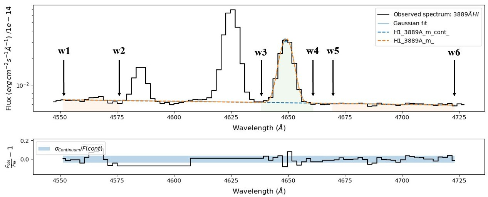
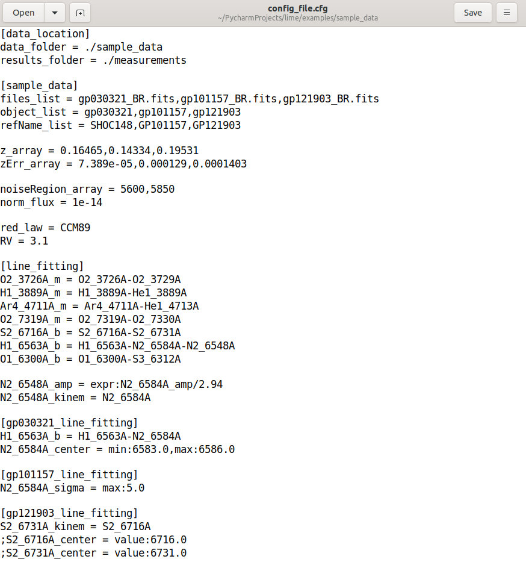
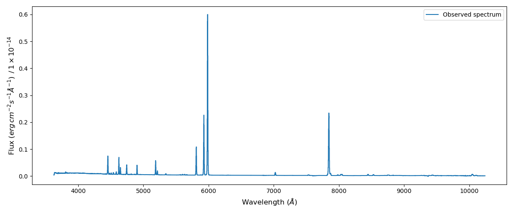
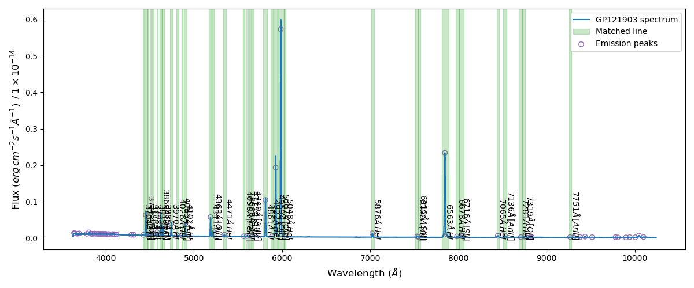
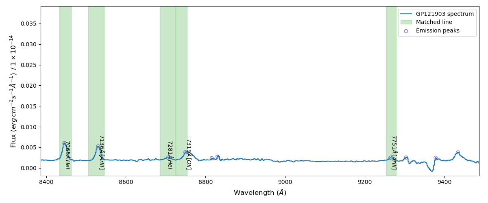
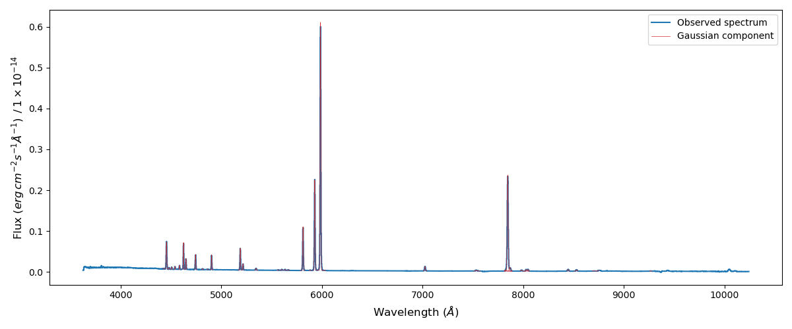
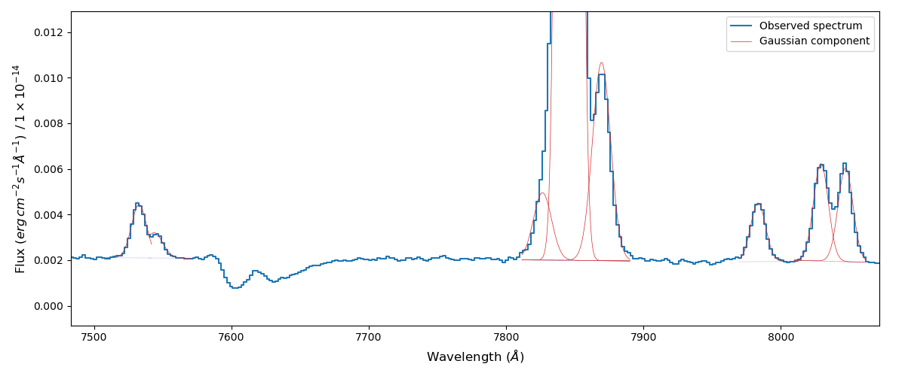
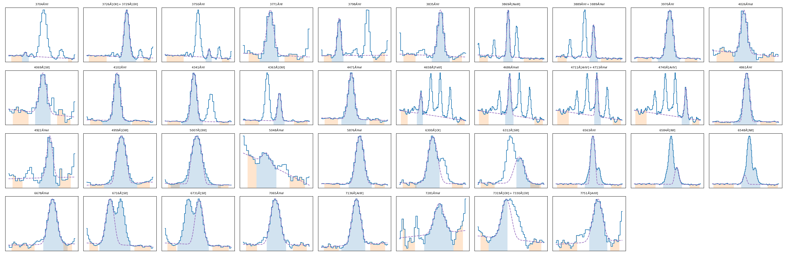

3) Fitting a complete spectrum
==============================

In this example we shall fit all the emission lines on the spectrum of the Green Pea galaxy GP121903
`(see Fernandez et al. 2021) <https://arxiv.org/abs/2110.07741>`_. You can download this spectrum from the
`github examples folder <https://github.com/Vital-Fernandez/lime/tree/master/examples>`_.

This tutorial can also be found as a python script in the `github 3rd example <https://github.com/Vital-Fernandez/lime/blob/master/examples/example3_fit_with_external_files.py>`_.

In this exercise, we are going to use the recommended :math:`\textsc{LiMe}` workflow: Using two external files with the lines masks and
and the fitting configuration. Let's start by specifying the data location:

.. code-block:: python

    import lime

    # State the data files
    obsFitsFile = './sample_data/gp121903_BR.fits'
    lineMaskFile = './sample_data/gp121903_BR_mask.txt'
    cfgFile = './sample_data/example_configuration_file.cfg'

The mask file consists in a text file where the line masks are stored as table where each row is an emission line and the
columns represent the wavelengths (in the rest frame) marking the regions of the adjacent continua and the line region:

To read this file you can use the ``.load_cfg`` function:

.. code-block:: python

    # Load mask
    maskDF = lime.load_lines_log(lineMaskFile)

This mask is loaded as a `pandas dataframe <https://pandas.pydata.org/docs/reference/api/pandas.DataFrame.html>`_:

.. code-block:: python

   print(maskDF)

.. code-block::

                      w1       w2       w3       w4       w5       w6
    H1_3704A     3685.00  3700.00  3700.45  3709.10  3758.00  3764.00
    O2_3726A_m   3665.75  3694.26  3716.02  3743.70  3754.88  3767.50
    H1_3750A     3663.49  3697.71  3743.70  3755.82  3775.22  3792.04
    H1_3771A     3755.82  3763.43  3764.47  3776.58  3778.32  3791.62
    H1_3798A     3776.99  3787.91  3788.69  3804.26  3843.10  3858.63
    H1_3835A     3803.91  3814.15  3828.48  3844.05  3844.26  3852.83
    Ne3_3869A    3800.00  3820.00  3857.89  3880.39  3905.00  3950.00
    H1_3889A_m   3806.90  3828.20  3880.39  3899.42  3905.00  3950.00
    H1_3970A     3932.80  3948.29  3956.51  3980.74  3984.86  3999.71
    He1_4026A    4003.60  4017.49  4018.80  4037.83  4038.20  4051.42
    S2_4069A     4046.00  4058.07  4063.78  4075.89  4080.64  4091.21
    H1_4102A     4074.51  4086.84  4088.01  4115.69  4116.50  4133.18
    H1_4341A     4305.95  4321.72  4325.04  4352.72  4375.04  4386.81
    O3_4363A     4297.70  4323.66  4352.72  4373.48  4390.76  4416.20
    He1_4471A    4443.57  4457.22  4461.72  4487.67  4490.31  4506.69
    Fe3_4658A    4601.29  4619.37  4646.85  4664.15  4759.96  4780.82
    He2_4686A    4603.53  4629.11  4674.53  4697.02  4753.23  4776.26
    Ar4_4711A_m  4605.00  4635.00  4705.67  4722.97  4755.00  4778.00
    Ar4_4740A    4605.87  4635.30  4729.89  4750.65  4757.09  4776.10
    H1_4861A     4809.80  4836.10  4840.62  4878.69  4883.13  4908.40
    He1_4922A    4889.81  4898.66  4913.29  4930.59  4929.34  4939.71
    O3_4959A     4925.25  4940.45  4940.97  4977.31  4976.72  4990.27
    O3_5007A     4972.79  4987.02  4977.31  5036.13  5031.60  5043.98
    He1_5048A    5027.57  5035.13  5036.13  5051.70  5060.81  5072.90
    He1_5876A    5833.00  5851.10  5863.14  5890.83  5893.72  5904.97
    O1_6300A     6267.64  6282.94  6290.23  6305.38  6322.77  6334.65
    S3_6312A     6267.64  6282.94  6310.23  6315.38  6322.77  6334.65
    H1_6563A_b   6438.03  6508.66  6535.10  6600.95  6627.70  6661.82
    He1_6678A    6629.20  6656.49  6663.22  6688.54  6691.35  6701.19
    S2_6716A_b   6686.70  6698.87  6700.90  6743.91  6750.60  6772.14
    He1_7065A    7029.10  7041.64  7055.22  7079.44  7087.49  7104.45
    Ar3_7136A    7091.54  7111.04  7115.78  7148.65  7154.48  7174.99
    He1_7281A    7241.85  7255.88  7266.30  7299.17  7298.76  7308.89
    O2_7319A_m   7288.71  7299.17  7304.26  7345.90  7349.35  7365.31
    Ar3_7751A    7707.43  7727.61  7742.09  7762.86  7765.73  7776.38

Afterwards we ned to read the configuration file. This is a text file which uses the
`conventional ini configuration format <https://en.wikipedia.org/wiki/INI_file>`_:

These files are organised in sections which are written with squared brackets in the text files. Each section can have
several options whose value is assigned with the equal symbol.

  .. note::
     In most cases, the names for the configuration file sections and options does not matter, nor do they need to be related
     to the :math:`\textsc{LiMe}` tasks. Nonetheless, the user is recommended to use some keywords in order to take advantage of :math:`\textsc{LiMe}`
     automation.

Beyond the default formatting done by the configparser library `configparser library <https://docs.python.org/3/library/configparser.html>`_,
:math:`\textsc{LiMe}` converts variable types if the following keywords are found:

* Option values which contain commas (,) will be converted into an array. This is done by splitting the text string by the commas.
* Option names with the _list or _array will be converted into a ``list` of strings or a float ``numpy.array`` respectively.
  This applies even if there are no commas (hence a single value array).
* Option names with the _check suffix will be converted to a boolean. The text string needs to follow the values acepted by
  the strtobool `strtobool function <https://docs.python.org/3/distutils/apiref.html>`_:
* Options names with the _folder or _file suffices will be left as strings.
* Section names containing the keyword line_fitting have an special treatment:
    * If the option value contains colons (:) it will be converted into a dictionary where each new dictionary entry is
      determined from the presence of commas (,).
    * If the option values which contain colons have a keyword matching the `LmFit Parameter <https://lmfit.github.io/lmfit-py/parameters.html>`_
      attributes (value, vary, min, max, expr) it will be converted to the expected variable type.

This conversion is done by the ``.load_cfg`` function:

.. code-block:: python

    # Load mask
    sample_cfg = lime.load_cfg(cfgFile, objList_check=True)

The ``sample_cfg`` variable is a dictionary of dictionaries, where each section and option names are keys of the parent and
child dictionaries respectively:

.. code-block:: python

    print(sample_cfg['sample_data']['z_array'])

.. code-block::

   [0.16465 0.14334 0.19531]

Using the data on this file, we are going to define the ``lime.Spectrum`` object for GP121903:

.. code-block:: python

    print(sample_cfg['sample_data']['z_array'])

    # Declare line measuring object
    z_obj = sample_cfg['sample_data']['z_array'][2]
    norm_flux = sample_cfg['sample_data']['norm_flux']
    gp_spec = lime.Spectrum(wave, flux, redshift=z_obj, norm_flux=norm_flux)
    gp_spec.plot_spectrum()

Before fitting the lines on the mask file, it is a good practice to confirm their presence of the spectrum. One way to do
that is using the ``.match_line_mask`` function:

.. code-block:: python

    peaks_table, matched_masks_DF = gp_spec.match_line_mask(maskDF, sample_cfg['sample_data']['noiseRegion_array'])

This function uses the ``.find_lines_derivative`` from the `specutils library <https://specutils.readthedocs.io/en/stable/fitting.html>`_
to find the peaks of flux on the spectrum. Afterwards, these peaks location are matched against the line mask location
(columns :math:`w3` and :math:`w4` in the mask file). This match can be easily appreciated introducing the outputs from the
``.match_line_mask`` in the ``.plot_spectrum`` function:

.. code-block:: python

    gp_spec.plot_spectrum(obsLinesTable=peaks_table, matchedLinesDF=matched_masks_DF, specLabel=f'Emission line detection',
                          frame=plots_frame)

If we zoom on the right hand side of this spectrum:

In this image the purple circles represent the emission peaks detected by the ``.find_lines_derivative`` function. The green
regions represent the lines in the input mask, which have matched with the detected emission peaks.

The output from the ``.match_line_mask`` includes two variables:

* The first one is the output `table <https://docs.astropy.org/en/latest/api/astropy.table.QTable.html#astropy.table.QTable>`_
  from the ``.find_lines_derivative`` function.

* The second one is a mask DataFrame with the matched lines. By default this function tries to compute the width of the line
  region for non-blended lines.

To save the new mask you can use the ``.save_line_log`` function:

.. code-block:: python

    lime.save_line_log(matched_masks_DF, 'corrected_mask_file', 'txt')

Using the GP121903 specific line mask we can start fitting the lines:

.. code-block:: python

    # Object line fitting configuration
    fit_cfg = sample_cfg['gp121903_line_fitting']

    # Measure the emission lines
    for i, lineLabel in enumerate(matched_masks_DF.index.values):
        wave_regions = matched_masks_DF.loc[lineLabel, 'w1':'w6'].values
        gp_spec.fit_from_wavelengths(lineLabel, wave_regions, user_cfg=fit_cfg)

In code above, the first step was extracting the line fitting configuration of GP121903:

.. code-block:: python

    print(fit_cfg)

.. code-block::

    {'O2_3726A_m': 'O2_3726A-O2_3729A',
     'H1_3889A_m': 'H1_3889A-He1_3889A',
     'Ar4_4711A_m': 'Ar4_4711A-He1_4713A',
     'O2_7319A_m': 'O2_7319A-O2_7330A',
     'S2_6716A_b': 'S2_6716A-S2_6731A',
     'H1_6563A_b': 'H1_6563A-N2_6584A-N2_6548A',
     'O1_6300A_b': 'O1_6300A-S3_6312A',
     'N2_6548A_amp': {'expr': 'N2_6584A_amp/2.94'},
     'N2_6548A_kinem': 'N2_6584A',
     'S2_6731A_kinem': 'S2_6716A'}

In this dictionary, we provide not only the components of the blended and merged lines, but also the constrains on
the Gaussian parameters.

.. note::
   As you analyse a line using the ``.fit_from_wavelengths`` function you can introduce the fitting configuration
   for all the lines. :math:`\textsc{LiMe}` will known which settings apply at each case.

The fitted profiles can be overplotted on the input spectrum using the ``profile_fittings=True`` attribute on the ``plot_spectrum``

.. code-block:: python

    gp_spec.plot_spectrum(frame=plots_frame, profile_fittings=True)

Or they can be plotted as a grid, including the mask selection, using the ``.plot_line_grid`` function:

.. code-block:: python

    gp_spec.plot_line_grid(gp_spec.linesDF)

As a final step, we can use the ``.save_line_log`` function to save your measurements.

.. code-block:: python

    lime.save_line_log(gp_spec.linesDF, 'gp121903_linelog', 'txt')
    lime.save_line_log(gp_spec.linesDF, 'gp121903_flux_table', 'pdf')
    lime.save_line_log(gp_spec.linesDF, 'gp121903_linelog', 'fits')
    lime.save_line_log(gp_spec.linesDF, 'gp121903_linelog', 'xls')

.. note::
   The file extension determines file type the line log will be save as. In the case of ``.fits`` and ``.xlsx`` files if you
   do not specify the page name, the default value is 'linelog'. This will overwrite the data if the 'linelog' page is already
   on the file.