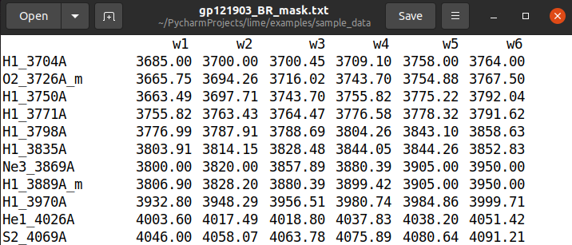
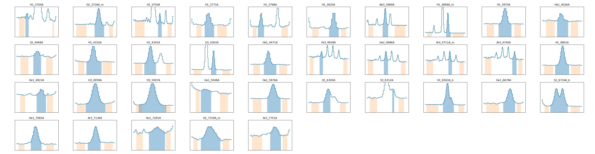
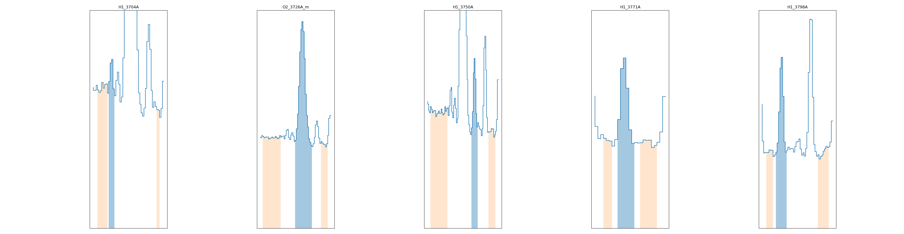
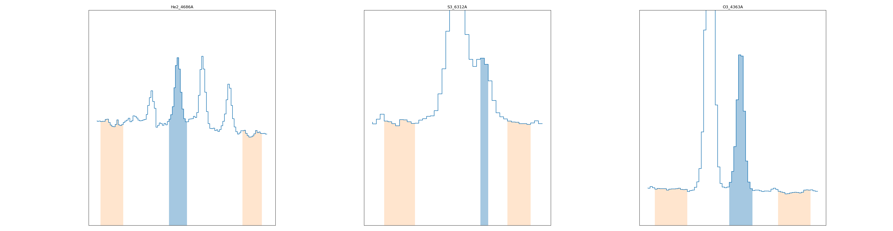

4) Spectral mask selection
==========================

An important step in the spectra analysis is the proper definition of the wavelength masks. :math:`\textsc{LiMe}` follows
a mask design based on the Lick indices `(see Zhang et al. 2005) <https://arxiv.org/abs/astro-ph/0508634v1>`_. These spectral
line incides are based on the data from the `Lick Observatory <https://www.lickobservatory.org/>`_ and they were proposed to study stellar age and metallicity.

The Lick indices consist in three wavelength intervals: One interval covers the line (emission and absorption) while the
other two cover a blue and red interval from the adcjacent continua. The first region is necessary to measure the line
properties while the other to are used to fit the local continuum. This can be seen in the following image:

.. image:: ../_static/mask_selection.jpg

The plot above shows the output `matplotlib <https://matplotlib.org/>`_ figure from the ``lime.Spectrum.display_results``
function. The upper plot shows the object spectrum where the input ``.flux`` is normalized by the ``.norm_flux``. The
mask wavelength limits (:math:`(w1, w2, ..., w6 )`) have been annotated over the plot. However, it may be appreciated that
there are three shaded regions below the spectrum shape. The green region corresponds to the line band while the orange
regions correspond to the continua bands.
<
The lower plot displays the observed spectrum minus the fitted profile (the solid black and dashed orange lines
respectively from the upper plot, respectively). In this plot, however, the regions outside the mask are not subtracted.
This is why there are flat regions (most visibly for the blue band) of the stepped line.

The mask file used by :math:`\textsc{LiMe}` consist in a seven columns table: One for the emission line label and six for
the line bands. The columns in this file are organized from lower to higher wavelengths.

In the recommended workflow, the user will move through three mask files:

1. A master mask: This file contains all the lines a researcher is interested.
2. An instrument mask: This file contains all the candidate lines, which might be found in a spectra sample given the
   instrument wavelength range and the observation with the largest signal-to-noise.
3. An object mask: This file only contains the lines observed in an object spectrum. The band limits have been individually
   inspected and adjusted to match the line width and to avoid uneven features on the adjacent continua.

In large observations, however, a compromise might be necessary for the last step. To make the task easier, lime includes
the ``.MaskInspector`` class.

This tutorial can also be found as a python script in the `github 4th example <https://github.com/Vital-Fernandez/lime/blob/master/examples/example4_interactive_mask_plots.py>`_.

Let's start by stating the sample data location and how to read it:

.. code-block:: python

    import numpy as np
    from astropy.io import fits
    import lime
    import shutil

    def import_osiris_fits(file_address, ext=0):

        # Open fits file
        with fits.open(file_address) as hdul:
            data, header = hdul[ext].data, hdul[ext].header

        w_min, dw, n_pix = header['CRVAL1'],  header['CD1_1'] , header['NAXIS1']
        w_max = w_min + dw * n_pix
        wavelength = np.linspace(w_min, w_max, n_pix, endpoint=False)

        return wavelength, data, header

    # State the data files
    obsFitsFile = './sample_data/gp121903_BR.fits'
    instrMaskFile = './sample_data/osiris_mask.txt'
    cfgFile = './sample_data/config_file.cfg'

Now we can prepare the data for the ``.MaskInspector`` class:

.. code-block:: python

    # Load the spectrum
    wave, flux, header = import_osiris_fits(obsFitsFile)

    # Load configuration
    sample_cfg = lime.load_cfg(cfgFile, obj_section={'sample_data': 'object_list'})

    # Object properties
    z_obj = sample_cfg['sample_data']['z_array'][2]
    norm_flux = sample_cfg['sample_data']['norm_flux']

    # Create a new mask file for the galaxy
    objMaskFile = './sample_data/GP121903_mask.txt'
    shutil.copy(instrMaskFile, objMaskFile)

In the last couple of lines we created a copy of the original mask. It is in this new file where will be writting the new
values. Once you run

.. code-block:: python

    # Manually inspect the masks and correct them iteratively
    lime.MaskInspector(objMaskFile, input_wave=wave, input_flux=flux, redshift=z_obj, norm_flux=norm_flux)

An interactive grid plot is displayed:

Clicking and dragging the mouse within a line plot cell will update the line band region (both in the plot and the
``lines_log_address`` file). There are some caveats in the window selection:

* The plot wavelength range is always 5 pixels beyond the mask bands. Therefore dragging the mouse beyond the mask limits
  (below :math:`w1` or above :math:`w6`) will change the displayed range. This can be used to move beyond the original
  mask limits.
* Selections between the :math:`w2` and :math:`w5` wavelength bands are always assigned to the line region mask as the new
  math:`w3` and :math:`w4` values.
* Due to the previous point, to increase the :math:`w2` value or to decrease :math:`w5` value the user must select a region
  between :math:`w1` and :math:`w3` or :math:`w4` and :math:`w6` respectively.
* The text file is updated with each new selection.

In the case, where the input spectrum has too many lines for the user monitor. It is possible to constrain the number of
lines via the ``lines_interval`` parameter. For example the user can specify an interval of lines to display in the
grid plot:

.. code-block:: python

    # In case you have many masks you can adjust the number of elements inspect the masks and correct them iteratively
    lines_interval = (6, 10)
    lime.MaskInspector(objMaskFile, input_wave=wave, input_flux=flux, redshift=z_obj, norm_flux=norm_flux,
                       n_cols=2, lines_interval=lines_interval)

Or the user can provide a list of lines with the same notation as in the mask file:

.. code-block:: python

    # You can also specify the lines you are interested in inspecting the mask
    lines_interval = ['He2_4686A', 'S2_6716A_b', 'O3_4363A']
    lime.MaskInspector(objMaskFile, input_wave=wave, input_flux=flux, redshift=z_obj, norm_flux=norm_flux,
                       lines_interval=lines_interval)

