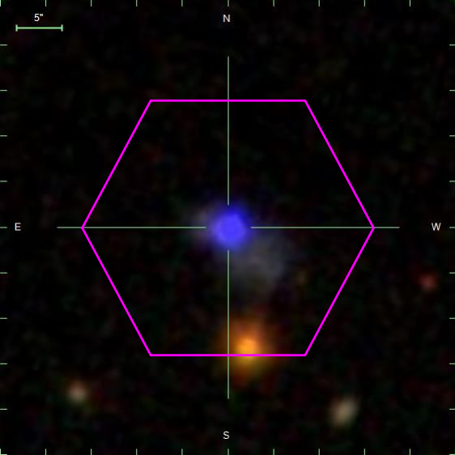
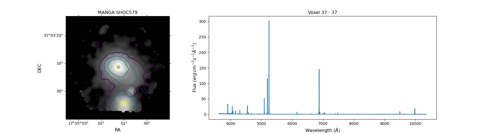
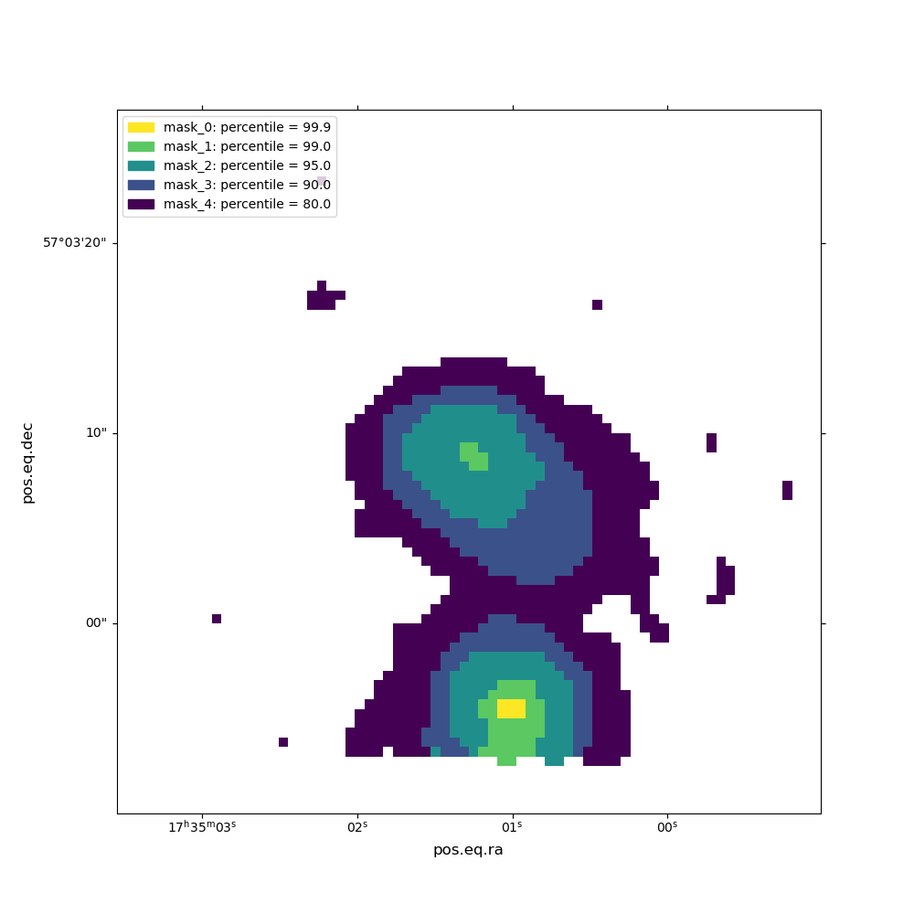
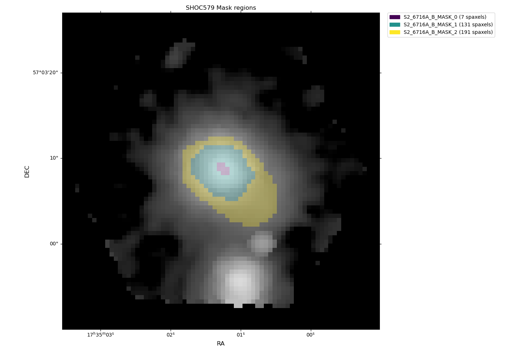

.. _example5:

5) IFU treatment: Spatial masks
===============================

In this tutorial, we perform a pre-analysis of an IFU (Integral Field Unit) cube. These data sets provide both spatial
and spectroscopic information of the observed light of astronomical bodies. You can find this tutorial as a python script
in the `github 5th example <https://github.com/Vital-Fernandez/lime/blob/master/examples/example5_IFU_Cube_masking.py>`_.

The :math:`\textsc{LiMe}` treatment we have seen in the previous tutorials remains the same for IFU data sets. However,
in order to preserve the spatial information and to maximise the quality of the measurements, it is recommended to use
spatial masks. These provide two advantages:

* In many cases, the scientific data does not cover the complete IFU field of view. For a better use of the astronomer's
  time and the computational resources, the non-scientific data should be excluded from the workflow.
* In most astronomical bodies, the phenomena responsible for the observed photons do not remain constant. For example,
  the gas ionization within a galaxy can change in a few IFU spaxels from very high to non-existent. Consequently, as the
  number and profile of the emission features changes, so should your analysis adapt. Spatial masks provide the means
  to personalise the :math:`\textsc{LiMe}` treatment.

Let's start by downloading one IFU data cube from the `MANGA survey <https://www.sdss.org/surveys/manga/>`_. In this
tutorial we will analyze `SHOC579 <https://dr17.sdss.org/marvin/galaxy/8626-12704/>`_, a compact galaxy with an intense
star forming region:

You can download the cube covering the field in the image above from the `MARVIN explorer <https://dr17.sdss.org/marvin/galaxy/8626-12704/>`_
website. However, you should be able to download the data cube with the commands:

.. code-block:: python

    import lime
    import wget
    import gzip
    import shutil
    import numpy as np
    from astropy.io import fits
    from pathlib import Path
    from matplotlib import pyplot as plt, cm, colors, patches
    from astropy.wcs import WCS

    # Function to download the cube if not done already
    def fetch_spec(save_address, cube_url):
        if not Path(save_address).is_file():
            wget.download(cube_url, save_address)
        return

    # Function to extract the compressed cube if not done already
    def extract_gz_file(input_file_address, output_file_address):
        print(output_file_address)
        if not Path(output_file_address).is_file():
            with gzip.open(input_file_address, 'rb') as f_in:
                with open(output_file_address, 'wb') as f_out:
                    shutil.copyfileobj(f_in, f_out)

    # Web link and saving location
    SHOC579_url = 'https://data.sdss.org/sas/dr17/manga/spectro/redux/v3_1_1/8626/stack/manga-8626-12704-LOGCUBE.fits.gz'
    SHOC579_gz_address = './sample_data/manga-8626-12704-LOGCUBE.fits.gz'

    # Download the data (it may take some time)
    fetch_spec(SHOC579_gz_address, SHOC579_url)

    # Extract the gz file
    SHOC579_cube_address = './sample_data/manga-8626-12704-LOGCUBE.fits'
    extract_gz_file(SHOC579_gz_address, SHOC579_cube_address)

.. note::

    The *wget* library may not be available in some operative systems. If you have issues, I woudl suggest to download
    cube directly from the `MARVIN page <https://dr17.sdss.org/marvin/galaxy/8626-12704/>`_ and to place it in the
    *sample_data* folder if you are running the `github 5th example <https://github.com/Vital-Fernandez/lime/blob/master/examples/example5_IFU_Cube_masking.py>`_.

The second step is visualizing the data. While the are many (and better) tools in the literature to visualize an
IFU cube, :math:`\textsc{LiMe}` provides the ``CubeFitsInspector`` class. This command opens an interactive `matplotlib <https://matplotlib.org/>`_.
window to display the spectrum of the right-clicked spaxel. Before running this task, however, we need to load the data:

.. code-block:: python

    # Open the cube fits file
    with fits.open(SHOC579_cube_address) as hdul:
        wave = hdul['WAVE'].data
        flux = hdul['FLUX'].data
        hdr = hdul['FLUX'].header

Now, we need to define a 2D image of our galaxy for the plot. Since this object luminosity comes from the ionized gas,
it is a good idea to use the emission lines bands. We can get this data from the masks files. Remember to take into
account the galaxy redshift:

.. code-block:: python

    # Load the configuration file and the line masks:
    cfgFile = './sample_data/config_file.cfg'
    obs_cfg = lime.load_cfg(cfgFile)
    z_SHOC579 = obs_cfg['SHOC579_data']['redshift']

    # and the masks file
    mask_file = './sample_data/osiris_mask.txt'
    mask_log = lime.load_lines_log(mask_file)

Now, we are going to generate a :math:`H\alpha` image summing all the pixels in the ``H1_6563A_b`` band (actually, this
band also includes the :math:`[NII]6548,6584\AA` emission). To do this, we do some `fancy indexing <https://numpy.org/doc/stable/user/basics.indexing.html>`_
on the data cube:

.. code-block:: python

    # Establish the band image for the plot bacground using Halpha
    Halpha_band = mask_log.loc['H1_6563A_b', 'w3':'w4'].values * (1 + z_SHOC579)
    idcs_Halpha = np.searchsorted(wave, Halpha_band)
    Halpha_image = flux[idcs_Halpha[0]:idcs_Halpha[1], :, :].sum(axis=0)

Finally, we have the option to include some contours in the plot. These can be from the background image or we can use
other flux image. For example, let's use the percentile intensity of the :math:`[SII]6716,6731\AA` band for these foreground
contours

.. code-block:: python

    # Use SII lines as the foreground image contours
    SII_band = mask_log.loc['S2_6716A_b', 'w3':'w4'].values * (1 + z_SHOC579)
    idcs_SII = np.searchsorted(wave, SII_band)
    SII_image = flux[idcs_SII[0]:idcs_SII[1], :, :].sum(axis=0)

    # Establishing the contours intensity using percentiles
    percentile_array = np.array([80, 90, 95, 99, 99.9])
    SII_contourLevels = np.nanpercentile(SII_image, percentile_array)

Now we can run the ``CubeFitsInspector`` class:

.. code-block:: python

    # Labels for the axes
    ax_conf = {'image': {'xlabel': r'RA', 'ylabel': r'DEC', 'title': f'MANGA SHOC579'}}

    # Color normalization for the flux band:
    min_flux = np.nanpercentile(Halpha_image, 60)
    log_norm_bg = colors.SymLogNorm(linthresh=min_flux, vmin=min_flux, base=10)

    # Interactive plotter for IFU data cubes
    lime.CubeFitsInspector(wave, flux, Halpha_image, SII_image, SII_contourLevels,
                           fits_header=hdr, axes_conf=ax_conf, color_norm=log_norm_bg)

.. note::

    The interpretation of the data can be heavily affected by the selected flux band, as well as the color palette
    and its normalization. The current phase: data visualization and mask selection is arguably the most important and
    the user is encouraged to attempt many strategies.

As you can see, SHOC579 has a very simple structure: A compact and circular star forming region at the center of the cube.
Additionally, you can appreciate that there is galaxy (LEDA 101544) with a very intense continuum in the southern region
of the field of view.

At this point we can design some spatial masks using the  ``spatial_mask_generator`` function. As in the contours above,
we are going to use the intensity percentiles of the ``'S2_6716A_b'`` band to define it:

.. code-block:: python

    # Output masks file address
    mask_file = './sample_data/SHOC579_mask.fits'

    # Create a dictionary with the coordinate entries for the header
    hdr_coords = {}
    for key in lime.COORD_ENTRIES:
        if key in hdr:
            hdr_coords[key] = hdr[key]

    # Run the task
    lime.spatial_mask_generator(SII_image, 'percentile', percentile_array, mask_ref='S2_6716A_b', output_address=mask_file,
                                fits_header=hdr_coords, show_plot=True)

In the script above, the ``lime.COORD_ENTRIES`` contains the list of *.fits* keys which contain the World Coordinate System
`(WCS) <https://fits.gsfc.nasa.gov/fits_wcs.html>`_. It is a good practice to export these keys and values into your new *.fits*
file. This way, you can plot your data with the astronomical coordinates without loading the WCS from the observational file.

The ``spatial_mask_generator`` should have generated a *.fits* file at the ``mask_file`` location alongside an image
with the ``mask_ref`` name + ``_mask_contours.png``:

This image displays the 5 masks in the output ``mask_file``. You may appreciate that the most intense ``'S2_6716A_b'``
band pixels are located in the LEDA 101544 region. We are going to remove these voxels from the masks of SHOC579
and for this analysis we are going to limit the analysis to the spaxels in the masks 1, 2 and 3.

.. code-block:: python

    # Parameters for the new masks
    coord_lower_limit = 22
    mask_list = ['S2_6716A_B_MASK_1', 'S2_6716A_B_MASK_2', 'S2_6716A_B_MASK_3']

    # New HDUs for the modified mask
    hdul_new = fits.HDUList([fits.PrimaryHDU()])

    # Open the mask file, loop through the target masks and set voxels below row 22 outside the mask (False)
    with fits.open(mask_file) as hdul:
        for i, mask_ext in enumerate(mask_list):
            mask_frame = hdul[mask_ext].data.astype('bool')
            mask_frame[:coord_lower_limit, :] = False
            hdul_new.append(fits.ImageHDU(name=f'S2_6716A_B_MASK_{i}', data=mask_frame.astype(int),
                                      ver=1, header=fits.Header(hdr_coords)))

.. note::

    *.fits* files cannot handle boolean parameters. :math:`\textsc{LiMe}` follows a standard approach which consists in
    saving masks as integers. In this case, **0** is treated as **False** and **1** as **True**.

In the code above, we renamed the new masks with an index suffix starting at zero. To confirm that the masks are
covering the scientific region, we are going to plot masks over the galaxy :math:`H\alpha` image:

.. code-block:: python

    # Load one of the masks headers to get the WCS for the plot
    masks_hdr = fits.getheader(mask_file, extname='S2_6716A_B_MASK_0')

    # Plot the Halpha image of the cube with the new masks
    fig = plt.figure(figsize=(14, 10))
    ax = fig.add_subplot(projection=WCS(masks_hdr), slices=('x', 'y'))
    im = ax.imshow(Halpha_image, cmap=cm.gray, norm=log_norm_bg)

    # Color map for the contours
    cmap_contours = cm.get_cmap('viridis', len(mask_list))

    legend_list = [None] * len(mask_list)

    # Open the mask .fits file and plot the masks as numpy masked array
    with fits.open(mask_file) as hdul:
        for i, HDU in enumerate(hdul):
            if i > 0:
                mask_name, mask_frame = HDU.name, HDU.data
                mask_frame = hdul[i].data.astype('bool')
                n_voxels = np.sum(mask_frame)

                inv_masked_array = np.ma.masked_where(~mask_frame, Halpha_image)

                cm_i = colors.ListedColormap([cmap_contours(i - 1)])
                ax.imshow(inv_masked_array, cmap=cm_i, vmin=0, vmax=1, alpha=0.3)
                legend_list[i - 1] = patches.Patch(color=cm_i(i - 1), label=f'{mask_name} ({n_voxels} spaxels)')

    # Define the legend for the imshow plot
    ax.legend(handles=legend_list, bbox_to_anchor=(1.025, 1), loc=2, borderaxespad=0.)
    ax.update({'title': r'SHOC579 Mask regions', 'xlabel': r'RA', 'ylabel': r'DEC'})
    plt.tight_layout()
    plt.show()

This script should produce the following plot:

Now, we only have three masks which cover the core of SHOC579. In the figure above, the legend includes the
number of spaxels in each spatial mask: 7, 131 and 191. In the next tutorial, we are going to fit the emission lines in
these spectra using this spatial mask.