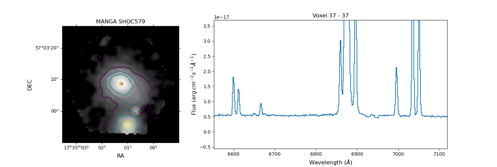
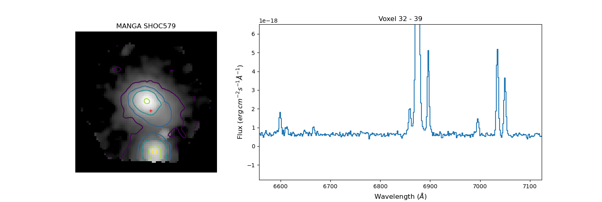
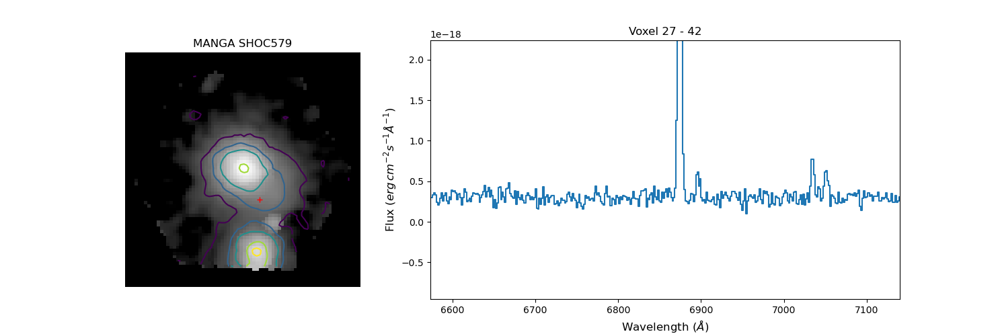
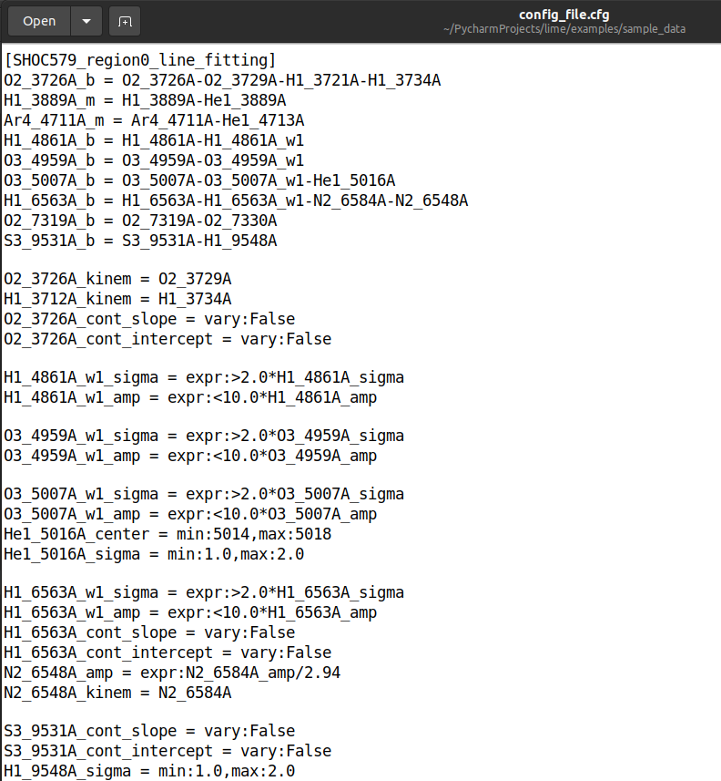
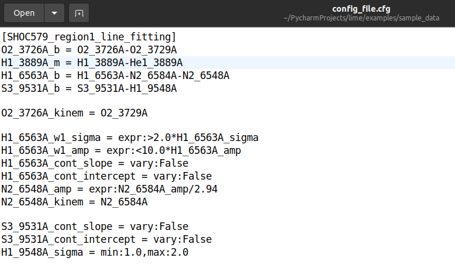

.. _example6:

6) IFU treatment: Line measurement
==================================

In this tutorial, we continue our analysis on the galaxy `SHOC579 <https://dr17.sdss.org/marvin/galaxy/8626-12704/>`_ using
the spatial mask from the :ref:`previous tutorial <example5>`.

This tutorial can be found as a script at the `github 6th example <https://github.com/Vital-Fernandez/lime/blob/master/examples/example6_IFU_fitting.py>`_.
Moreover, you may notice that many of the steps are the same as in the single observation of the :ref:`3rd example <example3>`.
Indeed, the main difference is that in this case we are going to treat 329 spectra. Most of the extra steps involve
reading the data from the spatial mask and some good practices to better handle the larger workflow.

We start again by downloading the `MANGA cube <https://dr17.sdss.org/marvin/galaxy/8626-12704/>`_:

.. code-block:: python

    import lime
    import wget
    import gzip
    import shutil
    import numpy as np
    from astropy.io import fits
    from pathlib import Path

    # Function to download the cube if not done already
    def fetch_spec(save_address, cube_url):
        if not Path(save_address).is_file():
            wget.download(cube_url, save_address)
        return

    # Function to extract the compressed cube if not done already
    def extract_gz_file(input_file_address, output_file_address):
        print(output_file_address)
        if not Path(output_file_address).is_file():
            with gzip.open(input_file_address, 'rb') as f_in:
                with open(output_file_address, 'wb') as f_out:
                    shutil.copyfileobj(f_in, f_out)

    # Web link and saving location
    SHOC579_url = 'https://data.sdss.org/sas/dr17/manga/spectro/redux/v3_1_1/8626/stack/manga-8626-12704-LOGCUBE.fits.gz'
    SHOC579_gz_address = './sample_data/manga-8626-12704-LOGCUBE.fits.gz'

    # Download the data (it may take some time)
    fetch_spec(SHOC579_gz_address, SHOC579_url)

    # Extract the gz file
    SHOC579_cube_address = './sample_data/manga-8626-12704-LOGCUBE.fits'
    extract_gz_file(SHOC579_gz_address, SHOC579_cube_address)

Now we declare the configuration files including the spatial mask:

.. code-block:: python

    # State the data location
    spatial_mask = './sample_data/SHOC579_mask.fits'
    cfgFile = './sample_data/config_file.cfg'

    # Get the galaxy data
    obs_cfg = lime.load_cfg(cfgFile)
    z_SHOC579 = obs_cfg['SHOC579_data']['redshift']
    norm_flux = obs_cfg['SHOC579_data']['norm_flux']
    noise_region = obs_cfg['SHOC579_data']['noise_interval_array']

.. note::

    You may have noticed that that in these tutorials, we are using the same file to store the :math:`\textsc{LiMe}`.
    configuration (``config_file.cfg``). However, this is not the best approach. You should use one configuration file
    per scientific project.

Next we load the MANGA cube:

.. code-block:: python

    # Open the cube fits file
    with fits.open(SHOC579_cube_address) as hdul:
        wave = hdul['WAVE'].data
        flux = hdul['FLUX'].data * norm_flux
        hdr = hdul['FLUX'].header

.. note::

    In this case we are removing the normalization of the MANGA cube :math:`(10^{-17})`. We will, however, include the
    same normalization in the ``lime.Spectrum`` definition. The difference between both approaches is that since :math:`\textsc{LiMe}`
    removes the input normalization in the output measurements, the results will be saved in absolute units. This is,
    however, just a personal choice.

Since we are analysing many spectra, we shall prepare the output container in advance. This will be a *.fits* file. We
use astropy to create an `HDUList <https://docs.astropy.org/en/stable/io/fits/index.html>`_ where the first HDU has the
primary (default) format:

.. code-block:: python

    # Output data declaration:
    log_address = f'./sample_data/SHOC579_log.fits'
    hdul_log = fits.HDUList([fits.PrimaryHDU()])

Moreover, we shall recover the World Coordinate System `(WCS) <https://fits.gsfc.nasa.gov/fits_wcs.html>`_ keys from the
original cube to maintain the astronomical coordinate systems in the output log file:

.. code-block:: python

    # WCS header data
    hdr_coords = {}
    for key in lime.COORD_ENTRIES:
        if key in hdr:
            hdr_coords[key] = hdr[key]
    hdr_coords = fits.Header(hdr_coords)

Finally, in the initial implementation of your pipeline, you may be interested in plotting the intermediate steps and
indexing the number of measurements. As your scripts becomes more stable handling missing or noisy data, this inspection is
not necessary and it may be enough saving the plots as external files. To make this protocol optinal we shall keep the data
plotting optional with this switch:

.. code-block:: python

    # Boolean check to plot the steps
    verbose = True

    # Counting the number of voxels and lines
    n_voxels, n_lines = 0, 0

We start the analysis by looping through the number of regions in our galaxy as they are defined in the ``spatial_mask``:

.. code-block:: python

    # Loop through the masks:
    for idx_region in [0, 1, 2]:

        # Load the region spatial mask:
        region_label = f'S2_6716A_B_MASK_{idx_region}'
        region_mask = fits.getdata(spatial_mask, region_label, ver=1)
        region_mask = region_mask.astype(bool)
        n_voxels += np.sum(region_mask)

        # Convert the mask into an array of spaxel coordinates (idxY, idxX)
        idcs_voxels = np.argwhere(region_mask)

        # Load the region spectral mask:
        mask_log_file = f'./sample_data/SHOC579_region{idx_region}_maskLog.txt'
        mask_log = lime.load_lines_log(mask_log_file)

        # Load the region fitting configuration
        region_fit_cfg = obs_cfg[f'SHOC579_region{idx_region}_line_fitting']

In the script above, not only are we loading the region spaxels at each region, but also the region fitting configuration
and mask log.

If you properly inspected the SHOC579 galaxy CUBE in the previous tutorial using the ``lime.CubeFitsInspector`` class,
you would notice the fast decrease on the ionized spectra intensity.

For example, checking the continuum in the :math:`H\alpha` proximity for a spaxel in the region 0:

Moving to a spaxel in the region 1:

and in the outskirts of the region 2, we have:

You may appreciate the intensity and number of lines changes dramatically. Consequently, the configuration of your fittings
should reflect this behaviour for more accurate and precise measurements.

The image below illustrates the line fitting configuration in the `config_file.cfg <https://github.com/Vital-Fernandez/lime/blob/master/examples/sample_data/config_file.cfg>`_
for the region 0, with many fitting adjustments:

In contrast, in region 1:

Only :math:`H\alpha` requires a complex fitting.

Finally in region 2:

.. image:: ../_static/6_region_2_cfg.png
    :align: center

All the lines can be assumed to be considered single Gaussians.

Similarly, the mask logs should also adapt to the different regions. You can see how the `mask for region 0 <https://github.com/Vital-Fernandez/lime/blob/master/examples/sample_data/SHOC579_region0_maskLog.txt>`_
includes many lines while the `mask for region 2 <https://github.com/Vital-Fernandez/lime/blob/master/examples/sample_data/SHOC579_region2_maskLog.txt>`_
only the strongest ones. This helps decreasing the number of positive detections in the outer regions where the SHOC579
cube has a noiser observation.

.. note::

    You should also remember to update the line labels in the mask logs. In the mask of the central core the mask for .
    :math:`H\alpha` should include the **_b** suffix for the blended analysis. In contrast, in the outer region where we
    don't observe a wide component or the :math:`[NII]` photons, the :math:`H\alpha` label should not include a suffix.

Using this data we proceed to define our ``lime.Spectrum`` object and identify the observed lines:

.. code-block:: python

        # Loop through the spaxels
        print(f'- Treating region {idx_region}')
        for idx_spaxel, coords_spaxel in enumerate(idcs_voxels):

            # Define a spectrum object for the current spaxel
            idxY, idxX = coords_spaxel
            spaxel_spec = lime.Spectrum(wave, flux[:, idxY, idxX], redshift=z_SHOC579, norm_flux=norm_flux)

            if verbose:
                spaxel_spec.plot_spectrum(spec_label=f'SHOC579 spaxel {idxY}-{idxX}')

            # Limit the line fittings to those detected
            peaks_table, matched_mask_log = spaxel_spec.match_line_mask(mask_log, noise_region)
            n_lines += len(matched_mask_log.index)

            if verbose:
                spaxel_spec.plot_spectrum(peaks_table=peaks_table, match_log=matched_mask_log,
                                          spec_label=f'SHOC579 spaxel {idxY}-{idxX}')

In the final loop, we measure the detected lines:

.. code-block:: python

            # Loop through the detected lines
            print(f'-- Treating spaxel {idx_spaxel}')
            for idx_line, line in enumerate(matched_mask_log.index):

                wave_regions = matched_mask_log.loc[line, 'w1':'w6'].values

                try:
                    spaxel_spec.fit_from_wavelengths(line, wave_regions, fit_method='least_squares', user_cfg=region_fit_cfg)

                    if verbose:
                        if '_b' in line:
                            spaxel_spec.display_results(fit_report=True, frame='rest')

                except ValueError as e:
                    print(f'--- Line measuring failure at {line} in spaxel {idxY}-{idxX}:\n{e}')

            if verbose:
                spaxel_spec.plot_line_grid(spaxel_spec.log)

.. warning::

    The ``try:... except:`` syntax in the code above is a mechanism for `Python error handling <https://docs.python.org/3/tutorial/errors.html>`_.
    This means that if a computational error occurs in the ``fit_from_wavelengths`` the algorithm will continue to work. In
    the current beta version, :math:`\textsc{LiMe}` can only detect/handle a few errors. Consequently, once the user has
    confirmed that their scripts work in a many spectra, this syntax can avoid avoid abrupt stops in large data set
    analysis from a single line measurement error.

Once the lines have been measured we could save them into a *.fits* extension. However, in large data sets appending
pages to a *.fits* can increase the computational time. Instead, we shall convert the ``lime.log`` into an HDU using the
``lime.log_to_HDU`` function an append it to the ``hdul_log``:

.. code-block:: python

            # Convert the measurements log into a HDU and append it to the HDU list unless it is empty
            linesHDU = lime.log_to_HDU(spaxel_spec.log, ext_name=f'{idxY}-{idxX}_LINESLOG', header_dict=hdr_coords)

        # Check the HDU is not empty (no lines measured)
        if linesHDU is not None:
            hdul_log.append(linesHDU)

This HDUl will be written into a *.fits* file at the end of every new region analysis. This will overwrite the one from
the previous iteration but since it contains the spaxels logs from the previos iteration no data are lost:

.. code-block:: python

        # After the regions voxels have been analysed save all the measurements to a .fits file
        hdul_log.writeto(log_address, overwrite=True, output_verify='fix')

    print(f'SHOC579 analysis finished with {n_lines} in {n_voxels}')

At this point, we have our measurements. In the next tutorial, we shall use :math:`\textsc{LiMe}` to check them.