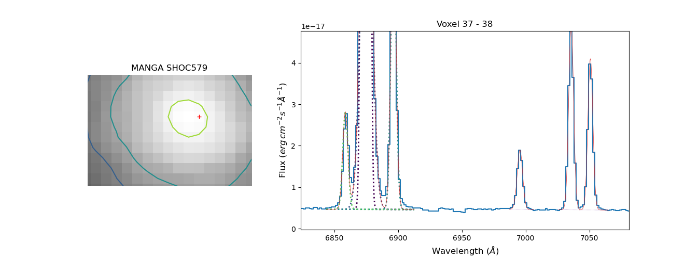
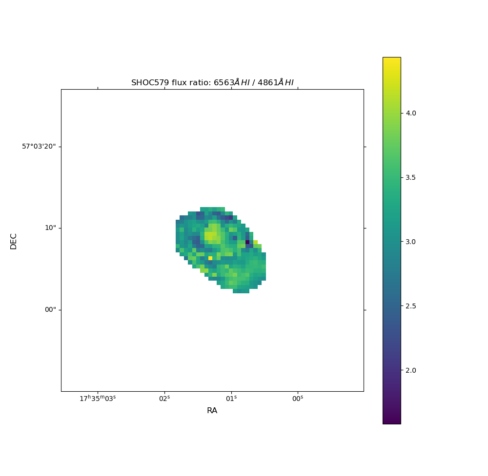
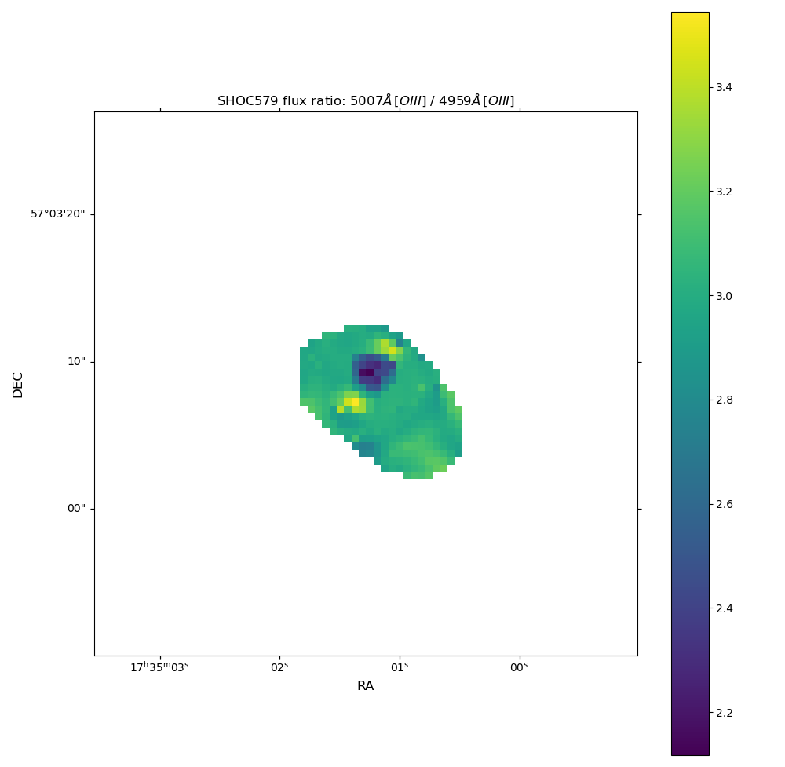
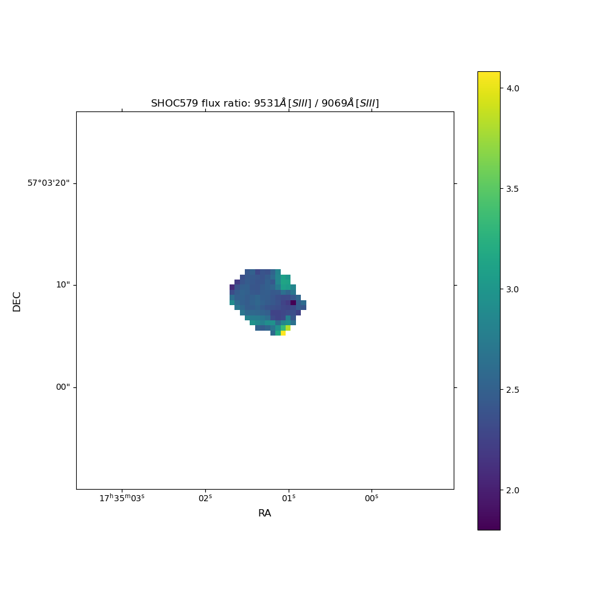

7) IFU treatment: Checking the results
======================================

In this tutorial we conclude the analysis of th MANGA cube of `SHOC579 <https://dr17.sdss.org/marvin/galaxy/8626-12704/>`_.
The code below assumes that you have the spatial mask an the measurements log from the previous tutorials. As in the previous
cases, this tutorial can be found as a script in the github `7th example <https://github.com/Vital-Fernandez/lime/blob/master/examples/example6_IFU_results.py>`_.

As in the previous tutorials we shall start stating the data location and downloading/extracting the `MANGA cube <https://dr17.sdss.org/marvin/galaxy/8626-12704/>`_:
if  you have not already:

.. code-block:: python

    import lime
    import wget
    import gzip
    import shutil
    import numpy as np
    from astropy.io import fits
    from pathlib import Path
    from matplotlib import pyplot as plt, cm, colors, patches
    from astropy.wcs import WCS

    # Function to download the cube if not done already
    def fetch_spec(save_address, cube_url):
        if not Path(save_address).is_file():
            wget.download(cube_url, save_address)
        return

    # Function to extract the compressed cube if not done already
    def extract_gz_file(input_file_address, output_file_address):
        print(output_file_address)
        if not Path(output_file_address).is_file():
            with gzip.open(input_file_address, 'rb') as f_in:
                with open(output_file_address, 'wb') as f_out:
                    shutil.copyfileobj(f_in, f_out)

    # Web link and saving location
    SHOC579_url = 'https://data.sdss.org/sas/dr17/manga/spectro/redux/v3_1_1/8626/stack/manga-8626-12704-LOGCUBE.fits.gz'
    SHOC579_gz_address = './sample_data/manga-8626-12704-LOGCUBE.fits.gz'

    # Download the data (it may take some time)
    fetch_spec(SHOC579_gz_address, SHOC579_url)

    # Extract the gz file
    SHOC579_cube_address = './sample_data/manga-8626-12704-LOGCUBE.fits'
    extract_gz_file(SHOC579_gz_address, SHOC579_cube_address)

    # State the data location (including the spatial mask and lines log from the previous tutorials)
    spatial_mask = './sample_data/SHOC579_mask.fits'
    cfgFile = './sample_data/config_file.cfg'
    log_file = './sample_data/SHOC579_log.fits'

    # Get the galaxy data
    obs_cfg = lime.load_cfg(cfgFile)
    z_SHOC579 = obs_cfg['SHOC579_data']['redshift']
    norm_flux = obs_cfg['SHOC579_data']['norm_flux']

    # Open the cube fits file
    with fits.open(SHOC579_cube_address) as hdul:
        wave = hdul['WAVE'].data
        flux = hdul['FLUX'].data * norm_flux
        hdr = hdul['FLUX'].header

As we did in the previous tutorial, we are going to use the ``lime.CubeFitsInspector`` class to plot the
galaxy IFU cube:

.. code-block:: python

    # and the masks file:
    mask_file = './sample_data/SHOC579_region0_maskLog.txt'
    mask_log = lime.load_lines_log(mask_file)

    # Establish the band image for the plot bacground using Halpha
    Halpha_band = mask_log.loc['H1_6563A_b', 'w3':'w4'].values * (1 + z_SHOC579)
    idcs_Halpha = np.searchsorted(wave, Halpha_band)
    Halpha_image = flux[idcs_Halpha[0]:idcs_Halpha[1], :, :].sum(axis=0)

    # Use SII lines as the foreground image contours
    SII_band = mask_log.loc['S2_6716A', 'w3':'w4'].values * (1 + z_SHOC579)
    idcs_SII = np.searchsorted(wave, SII_band)
    SII_image = flux[idcs_SII[0]:idcs_SII[1], :, :].sum(axis=0)

    # Establishing the contours intensity using percentiles
    percentile_array = np.array([80, 90, 95, 99, 99.9])
    SII_contourLevels = np.nanpercentile(SII_image, percentile_array)

    # Labels for the axes
    ax_conf = {'image': {'xlabel': r'RA', 'ylabel': r'DEC', 'title': f'MANGA SHOC579'}}

    # Color normalization for the flux band:
    min_flux = np.nanpercentile(Halpha_image, 60)
    log_norm_bg = colors.SymLogNorm(linthresh=min_flux, vmin=min_flux, base=10)

    # Interactive plotter for IFU data cubes
    lime.CubeFitsInspector(wave, flux, Halpha_image, SII_image, SII_contourLevels, redshift=z_SHOC579,
                           fits_header=hdr, axes_conf=ax_conf, color_norm=log_norm_bg,
                           lines_log_address=log_file)

In this case, however, we are going to include the ``lines_log_address=log_file`` parameter. In this case, the spaxel
spectrum includes the gaussian profiles of the fitted lines:

The current plot theme has the following design:

* Lines consisting in a single transition or several merged transitions have a solid red profile.
* Lines consisting in multiple transitions have a dotted line profile. The line color is assigned according to the its order
  in the ``blended_label`` description. For example, in the ``blended_label=H1_6563A-H1_6563A_w1-N2_6584A-N2_6548A`` the
  :math:`[NII]6584\AA` transition would be assigned the 3rd color in the palette. Consequently, spaxels which share
  this ``blended_label`` have the same color. This may not be longer true in spaxels which do not have the same ``blended_label``
* Lines whose measurement encountered an error are plotted in thick solid black lines. The most common error sources are:
    * The Gaussian profile fitting using the `LmFit library <https://lmfit.github.io/lmfit-py/model.html?highlight=errorbars#lmfit.model.errorbars>`_
      fails to converge within the user boundary conditions. In this case, it is recommended to switch to less restrictive
      boundary conditions or change the `minimizing algorithm <https://lmfit.github.io/lmfit-py/fitting.html#lmfit.minimizer.Minimizer.minimize>`_.
    * The line is very thin (1-2 pixels). In this case it might necessary to exclude the line or only use the integrated
      flux.
    * The adjacent continua is not flat and its shapes is weights more on the fitting than the line. In this case it
      might be necessary to change the adjacent continua mask and/or fix the continuum slope, intercept

The next tool consists in using the ``lime.save_param_maps`` function to generate a spatial map with the results from the
measurements in the log:

.. code-block:: python

    # WCS header data
    hdr_coords = {}
    for key in lime.COORD_ENTRIES:
        if key in hdr:
            hdr_coords[key] = hdr[key]
    hdr_coords = fits.Header(hdr_coords)

    # Plot the log results as maps
    param_list = ['intg_flux', 'intg_err', 'gauss_flux', 'gauss_err', 'v_r', 'v_r_err']
    lines_list = ['H1_4861A', 'H1_6563A', 'O3_4363A', 'O3_4959A', 'O3_5007A', 'S3_6312A', 'S3_9069A', 'S3_9531A']
    lime.save_param_maps(log_file, param_list, lines_list, output_folder='./sample_data/', spatial_mask_file=spatial_mask,
                         output_files_prefix='SHOC579_', page_hdr=hdr_coords)

This functions generates a set of *.fits* files with the following charactersitics:

* Each *.fits* file contains the results of a parameter from the input ``param_list``. The parameters in the ``param_list``
  must follow the same notation as in the measurements logs. This notation can be found in the :ref:`measurements documentation <measurements_page>`.
* Each the *.fits* file contains a `ImageHDU page <https://docs.astropy.org/en/stable/io/fits/api/images.html#astropy.io.fits.ImageHDU>`_
  per line in the input ``lines_list``. The default value per voxel cell is read from the ``default_spaxel_value=np.nan``
  parameter. This means that spaxels where a line could not be measured are assigned this default parameter value.
* The user should assign a spatial mask file address. This way the parameter mapping will be limited to those spaxels
  instead than the whole cube field of view.

.. note::

    Even providing a spatial mask in the ``lime.save_param_maps`` function, it may take some time to map the parameters
    in large cubes. The function should display a progress bar with the percentages of spaxels treated.

Once the function has finished, you should have 6 new *.fits* files with the ``SHOC579_parameter.fits`` notation.

To check the quality of the measurements (and/or the astronomical data), we can check a few flux ratios with the following
code:

.. code-block:: python

    # State line ratios for the plots
    lines_ratio = {'H1': ['H1_6563A', 'H1_4861A'],
                   'O3': ['O3_5007A', 'O3_4959A'],
                   'S3': ['S3_9531A', 'S3_9069A']}

    # State the parameter map file
    fits_file = f'./sample_data/SHOC579_gauss_flux.fits'

    # Loop through the line ratios
    for ion, lines in lines_ratio.items():

        # Recover the parameter measurements
        ion_array, wave_array, latex_array = lime.label_decomposition(lines)
        ratio_map = fits.getdata(fits_file, lines[0]) / fits.getdata(fits_file, lines[1])

        # Header for the astronomical coordinates plotting
        hdr = fits.getheader(fits_file, lines[0])

        # Create the plot
        fig = plt.figure(figsize=(10, 10))
        ax = fig.add_subplot(projection=WCS(hdr), slices=('x', 'y'))
        im = ax.imshow(ratio_map)
        cbar = fig.colorbar(im, ax=ax)
        ax.update({'title': f'SHOC579 flux ratio: {latex_array[0]} / {latex_array[1]}', 'xlabel': r'RA', 'ylabel': r'DEC'})
        plt.show()

For the :math:`\frac{H\alpha}{H\beta}` ratio we have:

For the :math:`\frac{[OIII]5007\AA}{[OIII]4959\AA}` ratio we have:

and for the :math:`\frac{[SIII]9531\AA}{[OIII]9069\AA}` ratio we have:

From this plots we can draw the following conclusions:

* The :math:`\frac{H\alpha}{H\beta}` provides a characterisation of the extinction on the SHOC579. This ration should be
  above around 2.98, the theoretical emissvity of these lines which is weakly dependant in other pheonomena such as the
  gas temperature and density. However, it seems some pixels have aprubt changes: Could this be because in some pixels of
  the region 1 we did not include the wide component :math:`H\alpha`. Does the profile fitting improve if we include it
  in this region?

* The :math:`\frac{[OIII]5007\AA}{[OIII]4959\AA}` ratio should remain constant around 3 independently of the physical
  conditions. Could this be a due to the profile fitting? You could check how this map changes if we use the integrated
  flux instead of the gaussian narrow component. Could it be that this line is too intense and therefore is incoming flux
  lies outside the linearity region?

* The :math:`\frac{[SIII]9531\AA}{[SIII]9069\AA}` ratio should remain constant around 2.47 independently of the physical
  conditions. This seems to be the case for most of the galaxies. In some spaxels, however, the value seems to be lower/higher.
  This could be explained by the teluric features in the proximity of these lines which could be harder to correct once
  the intensity of these lines is weaker. It may be necesarry to inspect these spaxels individually to confirm the
  if one or both lines are heavily contaminated.

As you may have noticed, at this point we are starting to derive scientific conclusions from the data. In any implementation
of :math:`\textsc{LiMe}`, the user is encouraged to review every step to better confirm the measurements reflect the physical
phenomena.
